 # SATCOM - Satellite Communication System
## QO-100 Ground Station & Multi-Client Architecture

---

## Table of Contents
1. [Project Overview](#project-overview)
2. [System Architecture](#system-architecture)
3. [Software Stack](#25-software-stack)
4. [Hardware Components](#3-hardware-components)
5. [Signal Processing Chain](#4-signal-processing-chain)
6. [Multi-Client Architecture](#5-satcoms-multi-client-architecture)
7. [Getting Started](#6-getting-started)
8. [Future Enhancements](#7-future-enhancements)
9. [Contributors](#8-contributors)
___

## Project Overview

### Introduction

SATCOM (Satellite Communication System) is a student project that builds a web-accessible ground station for the Es'hail-2 (QO-100) geostationary satellite. This isn't a commercial or professional system-it's a learning platform designed to demystify how satellite radio communication actually works while exploring modern software-defined radio technology and distributed systems architecture.

Es'hail-2, positioned at 25.9°E in geostationary orbit, made history in 2018 as the first amateur radio satellite in GEO. Unlike the low Earth orbit satellites that zip overhead for just 10-15 minutes, Es'hail-2 stays fixed in the sky, providing continuous 24/7 access to anyone who can see that point in the sky. For students and radio enthusiasts in Europe, Africa, the Middle East, and parts of Asia and South America, this means a permanently available platform for learning about satellite communications without needing to track moving satellites or wait for brief overhead passes.


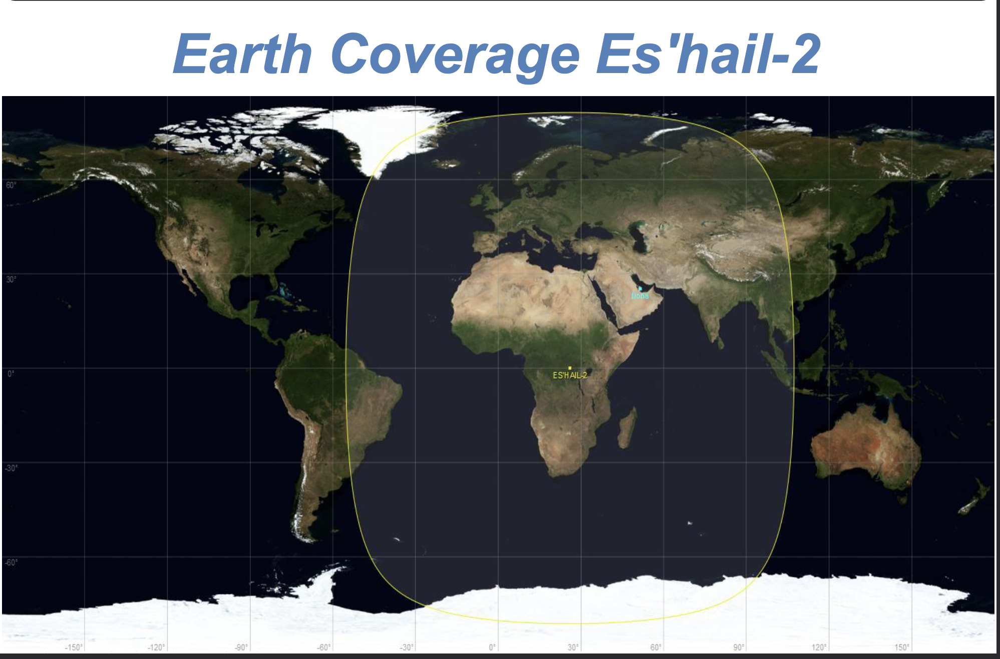

### Project Goals

This project started with a simple question: how do you let multiple people experience satellite communications without each needing their own dish, receiver, and expensive equipment? The answer involved combining several technologies-software-defined radio, GNU Radio signal processing, containerized microservices, and web technologies-into a system where anyone with a web browser can tune into satellite signals in real-time.

The educational value is threefold. First, it teaches the fundamentals of radio frequency signal processing: how weak signals from 36,000 kilometers away are captured, downconverted, filtered, and demodulated into intelligible audio. Second, it demonstrates software-defined radio principles, showing how the same hardware can be reconfigured through software to receive different modulations and bandwidths. Third, it explores distributed systems architecture, using Docker containers and Kubernetes orchestration to efficiently share resources among multiple simultaneous users.

This isn't about building the most sophisticated or feature-rich ground station. It's about understanding how the pieces fit together and making that knowledge accessible. When you open SATCOM in your browser and hear someone's voice that originated halfway around the world, bounced off a satellite, and was processed through multiple layers of hardware and software to reach you,that's the moment you understand how cool this project is.

### Why the QO-100 Narrowband Transponder?

Choosing which satellite and which transponder to target was critical for this educational project. The Es'hail-2 satellite hosts two amateur radio transponders: a wideband transponder carrying digital television signals (DVB-S2), and a narrowband transponder carrying traditional voice and data modes. We chose the narrowband transponder for several compelling reasons.

The narrowband transponder operates in linear mode, which means it's essentially a bent pipe in space. When someone transmits a single sideband voice signal on 2.4 GHz, the satellite receives it, amplifies it, shifts it up to 10.489 GHz, and retransmits it. The modulation stays the same,SSB on the ground becomes SSB in space becomes SSB on the ground again. This transparency makes it perfect for learning because you can directly understand the relationship between what goes up and what comes down. There's no complicated encoding, no error correction schemes to decode, no DVB receiver chips required. Just classic radio frequency techniques: mixing, filtering, and demodulation.

The narrowband transponder's 250 kHz bandwidth is also pedagogically ideal. It's wide enough to host dozens of simultaneous conversations,you'll often find stations from Germany talking to Egypt, or Spain to South Africa, all within this quarter-megahertz slice of spectrum. This gives students something interesting to explore: tuning across the transponder, finding active signals, listening to different languages and callsigns. Yet it's narrow enough that a modest software-defined radio like the PlutoSDR can capture the entire thing at once, making the multi-client architecture practical.

The geostationary orbit is perhaps the biggest advantage for education. LEO satellites race across the sky, visible for minutes before vanishing below the horizon. Tracking them requires computer-controlled antenna rotators, Doppler shift correction, and constant adjustment. Es'hail-2 just sits there. Point your dish at 25.9°E, and it works,today, tomorrow, next month. This reliability means students can experiment at their own pace, come back to the system anytime, and focus on learning signal processing rather than fighting with orbital mechanics.

Finally, there's an active community. At almost any hour, you'll find people using the transponder,running voice contacts, experimenting with digital modes. This makes SATCOM a window into the amateur radio community, showing students that this technology isn't just theoretical. Real people are having real conversations through space, and now you can listen in and understand exactly how it works.

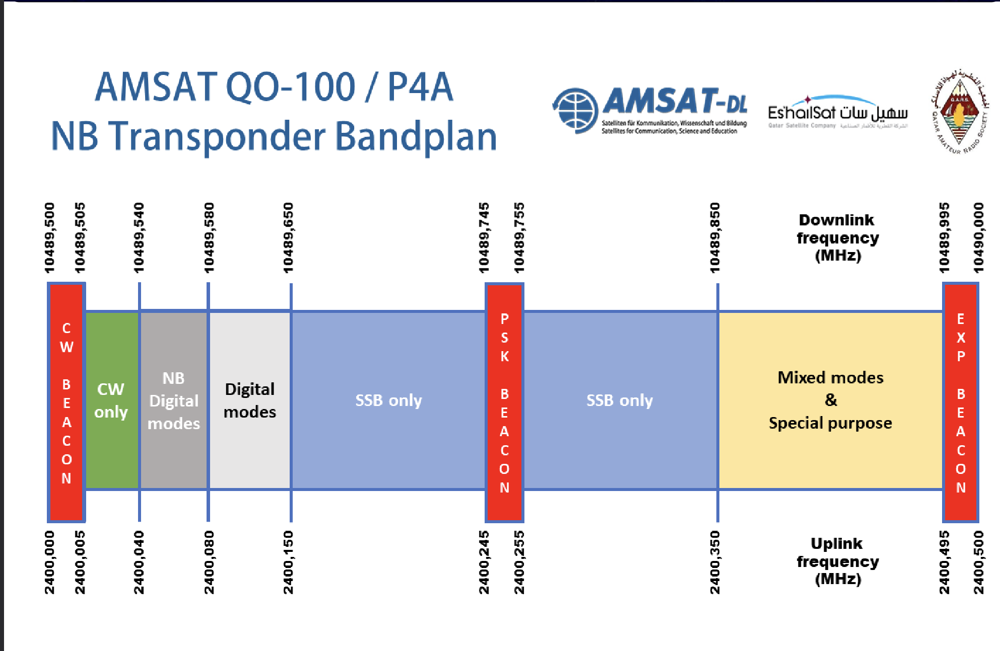

### Technical Approach

Building SATCOM meant solving a fundamental challenge: how do you share one radio receiver among many users when each wants to tune to a different frequency? A traditional approach would dedicate one complete receiver chain per user-separate hardware, separate software, separate everything. That's expensive, doesn't scale, and wastes resources since all those receivers are pointed at the same satellite capturing the same signals.

Our approach splits the system into shared and personalized components. The expensive parts-the physical hardware (dish, LNB, PlutoSDR), the GPS-disciplined frequency reference, and the wideband signal capture-are shared across all users. These components run once, capturing the entire 250 kHz transponder as raw I/Q samples and distributing this data stream where it's needed. (See [Hardware Components](#hardware-components) for detailed specifications.)

The personalized parts-frequency translation, filtering, and audio demodulation-happen in isolated containers, one per connected user. When you tune to 739.750 MHz and someone else tunes to 739.680 MHz, you each get a dedicated signal processing pipeline configured for your specific frequency. These pipelines are GNU Radio flowgraphs packaged as Docker containers, managed automatically by Kubernetes. When users connect, containers spin up. When users disconnect, containers terminate. Resources scale dynamically with demand. (Read more about the flowgraphs in [Signal Processing](#signal-processing) and the architecture in [Multi-Client Infrastructure](#multi-client-infrastructure).)

The visualization system is shared because everyone needs the same view of transponder activity. A single graphics worker computes FFTs across the full bandwidth and generates waterfall displays that all clients receive. This is efficient-FFT is computationally expensive, and there's no benefit to computing it separately for each user when the result is identical.

Communication between components uses ZeroMQ for distributing I/Q data (one publisher, many subscribers), UDP for sending processed audio and graphics data (fast, low latency), and WebSockets for browser-to-server communication (bidirectional, real-time). This architecture isn't exotic-it's standard distributed systems patterns applied to radio signal processing.

The result is a system where adding users adds minimal overhead. The first user and the twentieth user see nearly identical performance because the heavy lifting (hardware access, FFT) happens once regardless of how many people are listening. This scalability is what makes the multi-client educational platform practical.

---

## System Architecture

### Overview

SATCOM is a **receive-only ground station** designed to provide multi-client access to the QO-100 narrowband transponder downlink. The system focuses on high-quality signal reception, processing, and distribution to multiple simultaneous users through a scalable containerized architecture.

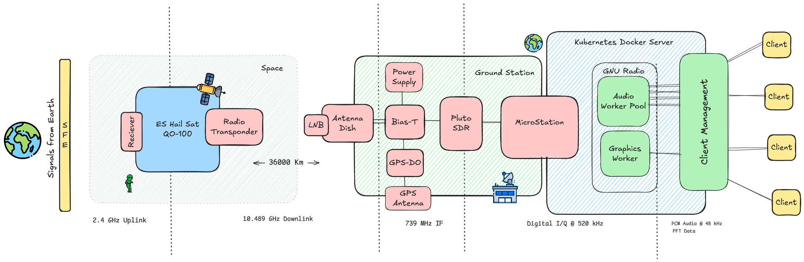

> **Diagram credit**: Mihir Kumar Patel.

### Reception System (SATCOM Core)

The SATCOM reception system is the heart of the project, handling all downlink signals from the QO-100 narrowband transponder:

**Signal Chain:**
1. **Parabolic Dish** receives 10.45-10.50 GHz signals from satellite
2. **LNB (Low-Noise Block)** downconverts to intermediate frequency (IF)
3. **PlutoSDR** digitizes the IF signal for software processing
4. **GPS-DO** provides stable frequency reference for accurate tuning
5. **GNU Radio** performs demodulation, filtering, and audio extraction
6. **Worker Pools** distribute processed audio and graphics to all connected clients

**Key Characteristics:**
- **Frequency Range**: 10.45-10.50 GHz (narrowband transponder downlink)
- **Polarization**: Linear (typically horizontal)
- **Bandwidth**: 500 kHz transponder coverage
- **Noise Figure**: Optimized LNB for weak signal reception
- **Stability**: GPS-disciplined oscillator ensures <1 PPM frequency accuracy

### Multi-Client Architecture

SATCOM's distributed backend allows multiple users to simultaneously listen to the same downlink:

**Architecture Benefits:**
- **Scalability**: Worker pools handle dynamic client loads
- **Resource Efficiency**: Single SDR serves multiple clients
- **Independent Tuning**: Each client can tune to different frequencies within the transponder
- **Real-Time Processing**: Low-latency audio and waterfall updates
- **Containerized Deployment**: Docker + Kubernetes for reliability and orchestration

**Worker Pool Design:**
- **Audio Workers**: Handle demodulation, audio processing, and streaming for individual clients
- **Graphics Workers**: Generate real-time waterfall and spectrum displays
- **Load Balancing**: Kubernetes distributes clients across available workers

### Integration with Transmission

While SATCOM is a **receive-only system**, it operates in the same environment as a separate professional transmission facility:

- **Transmission** is handled by an independent ground station with high-gain helix antenna
- **No SATCOM control** over TX path (no GNU Radio TX flowgraphs, no PlutoSDR TX, no GPS-DO TX sync)
- **Shared facility**: Both RX and TX point to the same QO-100 satellite
- **Current scope**: SATCOM focuses exclusively on listening and multi-client distribution

> **Future Consideration**: TX integration could be explored, but current system is optimized for scalable reception.

---

## 2.5 Software Stack

SATCOM relies on several key software technologies that work together to make the multi-client architecture possible.

### GNU Radio

GNU Radio is the heart of SATCOM's signal processing. It's a free, open-source software development toolkit for building software-defined radios. Instead of designing hardware circuits to filter, demodulate, and process radio signals, GNU Radio lets you do all of this in software using visual flowgraphs.

Think of GNU Radio Companion (GRC) as visual programming for radio. You drag and drop blocks-sources, filters, demodulators, sinks-and connect them like puzzle pieces. Each block performs a specific function: an FFT block does Fast Fourier Transforms, a frequency translating filter shifts signals, a complex-to-real block demodulates SSB. String them together, and you have a complete radio receiver running entirely in software.

For SATCOM, we use GNU Radio to build three main flowgraphs: the SDR server that interfaces with the PlutoSDR hardware, the audio worker that demodulates signals for each client, and the graphics worker that generates waterfall displays. These flowgraphs are what actually process the radio signals-everything else is just plumbing to distribute the work across multiple users.

**Want to learn GNU Radio?** The official [GNU Radio Tutorials](https://wiki.gnuradio.org/index.php/Tutorials) are an excellent starting point. They walk you through building your first flowgraphs, understanding signal processing blocks, and working with real SDR hardware. For this project, understanding blocks like Frequency Xlating FIR Filter, FFT, and rational resampler is particularly helpful.

### Docker & Kubernetes

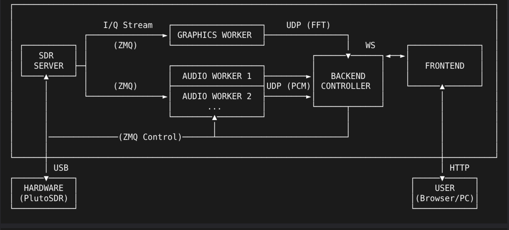

Docker and Kubernetes handle the multi-client infrastructure. Docker packages each GNU Radio flowgraph as a container-a self-contained unit that includes the flowgraph, all its dependencies, and a runtime environment. This means an audio worker container can run identically whether it's on your laptop, a server in a data center, or anywhere else.

Kubernetes orchestrates these containers. When a user connects to SATCOM, Kubernetes automatically spins up a new audio worker container for them. When they disconnect, Kubernetes terminates the container and frees the resources. It handles scheduling (which server should run this container?), networking (how do containers communicate?), and monitoring (is this container healthy?).

We won't dive deep into Docker and Kubernetes in this documentation-they're tools we use, not the focus of the project. But understanding that each user gets their own isolated container running their own GNU Radio flowgraph is key to grasping how SATCOM achieves multi-client operation.

---

## 3. Hardware Components

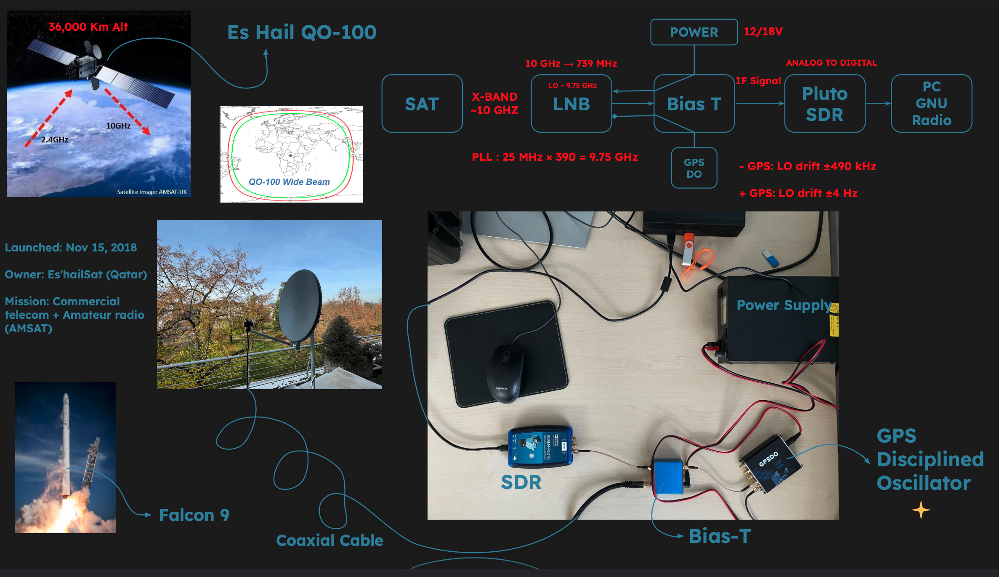

The SATCOM system relies on several key hardware components working together to capture, downconvert, and process satellite signals. This section introduces each component and explains its role in the signal chain. Think of it like a relay race: the satellite sends radio waves across 36,000 kilometers of space, the dish catches these incredibly weak signals, the LNB amplifies and translates them to a frequency our computer can handle, the PlutoSDR digitizes everything, and finally the host computer processes and distributes the signals to multiple users simultaneously.

---

### 3.1 The Signal Collection System

#### Parabolic Dish Antenna

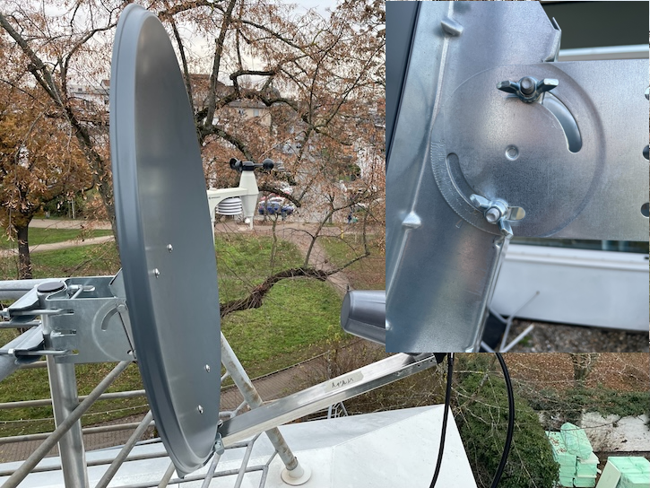


The dish antenna is the first point of contact with signals from space. It's essentially a standard satellite TV dish-the same type you might see mounted on rooftops across Europe for watching television.A dish between 60 and 120 centimeters in diameter works perfectly for receiving the QO-100 satellite's amateur radio signals.

The dish works by collecting electromagnetic waves from a very specific direction in the sky and focusing them onto a single point where the LNB sits. Because the Es'hail-2 satellite is in geostationary orbit at 25.9 degrees East, once you've pointed your dish correctly, it stays pointed-the satellite appears to hover at the same spot in the sky 24 hours a day.

One important detail: the QO-100 narrowband transponder uses linear horizontal polarization. This means you'll need to rotate the LNB to the correct orientation (usually marked on the mounting bracket) to maximize signal reception.

---

#### LNB (Low-Noise Block Downconverter) + Bias-T Box

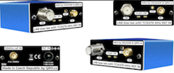


This is where things get interesting. The LNB is the device that sits at the focal point of the dish-the small box that actually "catches" the focused radio waves. But these signals coming from 36,000 kilometers away are extraordinarily weak and arrive at a frequency of 10.489 GHz, which is far too high for most receivers to handle directly.

The LNB performs two critical jobs. First, it amplifies these whisper-quiet signals while adding as little noise as possible-think of it as turning up the volume on a very faint recording without adding hiss. Second, it translates the frequency down from 10.489 GHz to something more manageable: around 739 MHz. This translation happens by mixing the incoming signal with an internal oscillator running at 9.75 GHz. The mathematical result (10.489 - 9.750 = 0.739 GHz) gives us our intermediate frequency or "IF" that will travel down the coaxial cable.

For the SATCOM project, we're using a LNB system that includes a Bias-T box. This special box serves multiple purposes. It sends DC power up the coaxial cable to the LNB (so we only need one cable, not separate power wires). It can inject a very precise 25 MHz reference signal that locks the LNB's internal oscillator to either a built-in temperature-compensated crystal or-much better-to an external GPS-disciplined oscillator.

The key innovation here is that everything travels on one coaxial cable: DC power going up to the LNB, the 25 MHz reference signal going up to lock the LNB's frequency, and the 739 MHz intermediate frequency coming back down to your receiver.


**Manual/Documentation**: 
- [hamparts.shop - 10 GHz LNB EXT OSC MK3 Manual](https://hamparts.shop/blog/10ghz-lnb-with-ext-osc-manual.html)
- [Product Page with Technical Details](https://hamparts.shop/10-ghz-lnb-ext-osc-mk3.html)

---

### 3.2 The Digital Processing System

#### PlutoSDR (ADALM-PLUTO)

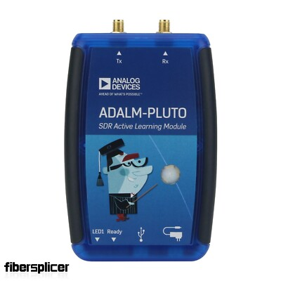

Now that we have our signal at a manageable frequency, we need to digitize it-convert those analog radio waves into digital data that a computer can process. That's where the PlutoSDR comes in. This small USB device, made by Analog Devices, is essentially a complete radio transceiver on a stick. For our purposes, we're only using the receiver side.

The PlutoSDR connects to your Bias-T box via a coaxial cable and receives the 739 MHz intermediate frequency signal. Inside, it samples this signal several million times per second, creating a stream of digital numbers that represent the radio signal. These numbers flow into your computer over USB, where GNU Radio can work with them.

One of the beautiful things about software-defined radio is flexibility. Instead of building separate hardware for different types of radio signals, the PlutoSDR simply captures a wide chunk of spectrum (in our case, the entire 250 kHz QO-100 transponder) and sends it to the computer. Software then does the work of filtering, demodulating, and decoding specific signals within that spectrum. This means a single PlutoSDR can simultaneously "hear" all the SSB voice contacts, CW morse code, and digital mode transmissions happening on the satellite at once.

The PlutoSDR can be modified to accept that external 10 MHz reference signal from our GPS-DO. This external reference dramatically improves frequency stability compared to the PlutoSDR's built-in crystal oscillator, which is essential for listening to SSB signals that occupy only 2.7 kHz of bandwidth.


**Manual/Documentation**: 
- [Analog Devices ADALM-PLUTO User Guide](https://wiki.analog.com/university/tools/pluto)
- [AD9363 RF Transceiver Datasheet](https://www.analog.com/en/products/ad9363.html)

---

#### GPS-DO (GPS Disciplined Oscillator)

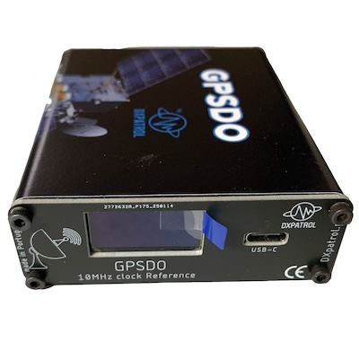

This might be the most underappreciated piece of the puzzle, but it's absolutely critical for serious satellite reception. The GPS-DO is a precision frequency reference that uses GPS satellites to generate an ultra-stable 10 MHz signal.

Radio receivers need to know exactly what frequency they're tuned to. If your receiver's internal clock drifts even slightly, signals will appear to move around in frequency, making them difficult or impossible to decode. The problem multiplies as frequencies get higher. The PlutoSDR's internal crystal oscillator might drift by 25 parts per million due to temperature changes. That doesn't sound like much, but when you multiply it by 10 GHz (the satellite frequency), that 25 PPM becomes a whopping 250 kHz error. An SSB voice signal is only 2.7 kHz wide-your entire signal would be completely off-frequency!

The GPS-DO solves this by listening to multiple GPS satellites, which carry atomic-clock-referenced timing signals. It uses this timing to discipline (lock) its internal oscillator to within better than 0.01 PPM accuracy. That same 25 PPM error is now reduced to just 100 Hz at 10 GHz-small enough that software can easily correct for it, and stable enough that SSB signals stay put.

The GPS-DO needs its own antenna with a clear view of the sky. After a warm-up period of 10-15 minutes, they settle into rock-solid frequency accuracy. The Bias-T box takes this 10 MHz signal, multiplies it to 25 MHz, filters it carefully through crystal filters to ensure purity, and sends it up to the LNB to lock its local oscillator.

---

#### Host Computer

The brain of the operation is a Linux computer running GNU Radio and the multi-client server infrastructure. This doesn't need to be anything exotic-a reasonably modern computer with at least four cores and 16 GB of RAM will do the job.

This computer has several responsibilities. First, it runs GNU Radio flowgraphs that process the raw I/Q data streaming in from the PlutoSDR. These flowgraphs perform frequency translation, filtering, demodulation (SSB, CW, digital modes), and audio processing. Second, it hosts the Docker containers that implement the multi-client architecture, allowing many users to connect simultaneously and each tune to different parts of the transponder. Third, it serves the web interface that users access through their browsers.

The choice of Linux comes down to tooling support. GNU Radio works best on Linux, with the most complete driver support and the richest ecosystem of signal processing blocks. Docker and Kubernetes also feel most at home in Linux environments. While you could theoretically run SATCOM on Windows or macOS, you'd be fighting uphill battles with driver compatibility and performance.

Processing real-time radio signals is computationally intensive, especially when serving multiple clients. Each client connection adds overhead: individual audio demodulation, waterfall generation, and network streaming. A modern multi-core processor ensures smooth operation even with a dozen simultaneous users.


**Software Documentation**: 
- [GNU Radio Documentation](https://wiki.gnuradio.org/)
- [Docker Documentation](https://docs.docker.com/)
- [Kubernetes Documentation](https://kubernetes.io/docs/)

---

### 3.3 The Mission: Es'hail-2 (QO-100) Satellite

While not hardware we own or control, understanding the Es'hail-2 satellite is essential for comprehending how SATCOM works.

Es'hail-2, also known by its amateur radio designation QO-100, was launched in November 2018 by SpaceX. It was a commercial satellite built for Es'hailSat of Qatar, but it carried a special payload built by AMSAT-DL specifically for amateur radio use. This made history as the first amateur radio transponder in geostationary orbit, meaning it's the first amateur satellite that doesn't rise and set like the old LEO satellites-it's always there, always accessible, hovering at the same point in the sky.

The satellite parks itself at 25.9 degrees East longitude, which gives it coverage over Europe, Africa, the Middle East, India, and parts of South America. If you can see that point in the sky from your location, you can use QO-100.

The amateur payload includes two transponders. The wideband transponder carries DVB-S digital television and high-speed data-it's not our focus here. The narrowband transponder is what SATCOM monitors: 250 kHz of spectrum dedicated to traditional amateur radio modes like SSB voice, CW (morse code), and narrow digital modes. Radio amateurs anywhere in the coverage area can transmit on 2.4 GHz (with appropriate equipment and licenses), and those signals are relayed back down at 10.489 GHz for everyone to hear.

The transponder operates in linear mode, meaning frequencies aren't inverted-an uplink at 2400.100 MHz appears on the downlink at 10489.600 MHz. The relationship is simple: downlink frequency = uplink frequency + 8089.5 MHz. The transponder passes everything through: voice conversations, morse code, PSK31, FT8, even SSTV images.

There's a continuous beacon at 10489.800 MHz (the upper edge of the transponder) that transmits CW and PSK telemetry. This beacon serves multiple purposes: it's a frequency reference for calibration, a signal quality indicator, and a target for initial antenna alignment when setting up your station.


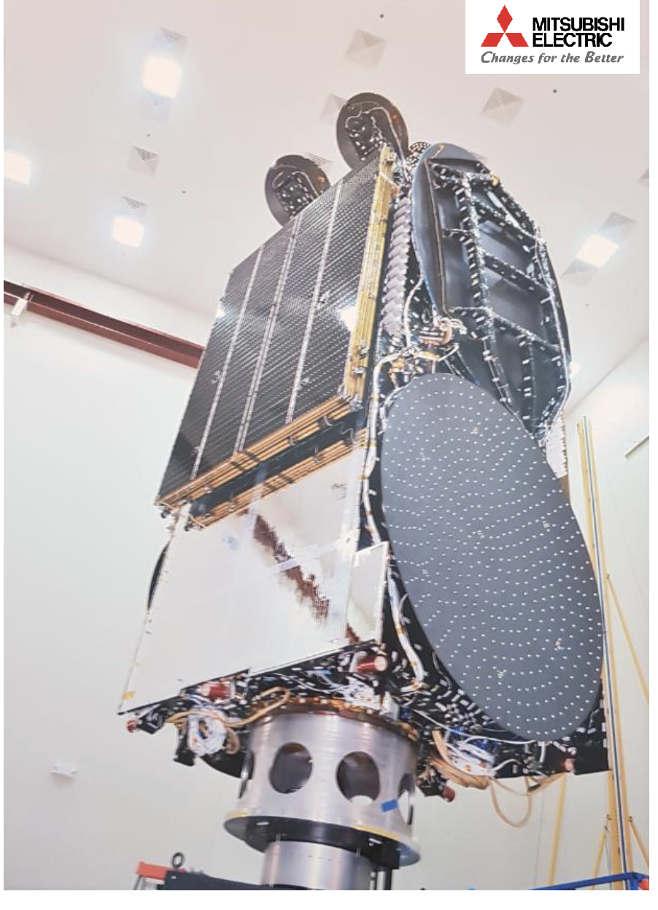

**Documentation**: 
- [AMSAT-DL QO-100 Information & Bandplan](https://amsat-dl.org/en/p4-a-nb-transponder-bandplan-and-operating-guidelines/)
- [QO-100 Operating Guidelines](https://amsat-dl.org/en/qo-100-operating/)
- [Es'hailSat Official Website](https://www.eshailsat.qa/)

---

## 4. Signal Processing Chain

This section explains how SATCOM transforms weak radio signals from space into clear audio that users can hear in their web browsers. We'll start with a bird's-eye view of the complete downconversion process, then dive into the specific signal processing steps that happen inside GNU Radio.

### 4.1 Complete Downconversion Overview

Understanding the signal processing chain requires following the signal from the satellite all the way to your speakers. The journey involves multiple frequency translations and processing stages, each designed to make the signal easier to work with.

#### The Signal's Journey: From 10 GHz to Audio

When a radio amateur transmits on 2.4 GHz to QO-100, the satellite receives it, amplifies it, and retransmits it at 10.489 GHz. This 10 GHz signal radiates down to Earth, spreading out over thousands of kilometers. By the time it reaches your dish, it's extraordinarily weak-we're talking about power levels around -120 dBm, which is less than a trillionth of a watt.

**Stage 1: Parabolic Dish Collection (10.489 GHz)**

The parabolic dish acts like a big funnel for radio waves. Its curved reflector collects energy from a large area and focuses it all onto the LNB at the focal point. A typical 80cm dish has a gain of about 35 dBi at 10 GHz, which means it concentrates the incoming signal power by roughly 3000 times. Even with this concentration, the signal is still incredibly weak.

**Stage 2: LNB Downconversion (10.489 GHz → 739 MHz)**

The LNB sitting at your dish's focal point performs the first critical frequency translation. It contains a low-noise amplifier that boosts the signal by about 50-60 dB while adding minimal noise (typically 0.1-0.3 dB noise figure). Then it mixes this amplified signal with a local oscillator running at precisely 9.750 GHz.

This mixing process creates sum and difference frequencies. The difference frequency (10.489 GHz - 9.750 GHz = 739 MHz) becomes our intermediate frequency (IF). Why downconvert? Because 10 GHz signals suffer high losses in coaxial cables and are difficult to process digitally. The 739 MHz IF signal can travel down your coax cable with minimal loss and is within the frequency range that the PlutoSDR can digitize.

The LNB's local oscillator must be extremely stable. If it drifts even slightly, your received signal will appear to change frequency. This is where the GPS-disciplined 25 MHz reference becomes critical. The Bias-T box multiplies the 10 MHz GPS-DO output to 25 MHz and sends it up the coax to the LNB, where it locks the local oscillator to GPS precision.

**Stage 3: PlutoSDR Digitization (739 MHz → Digital I/Q)**

The 739 MHz IF signal arrives at the PlutoSDR through a coaxial cable. Inside the PlutoSDR, the AD9363 transceiver chip performs several operations. First, it downconverts the 739 MHz signal to baseband (around 0 Hz) using quadrature mixing. This process produces two signals: In-phase (I) and Quadrature (Q), which together capture both the amplitude and phase information of the original signal.

The PlutoSDR then samples these I and Q signals with its analog-to-digital converters, running at a sample rate we configure (typically 2-4 million samples per second for SATCOM). Each sample is digitized to 12-bit precision. The result is a stream of complex numbers flowing over USB to the host computer at rates of several megabytes per second.

Why I/Q sampling instead of just amplitude? Because I/Q representation preserves all the information about the signal, including which side of the center frequency it's on. This is essential for SSB demodulation, where upper sideband and lower sideband occupy different sides of the carrier.

**Stage 4: GNU Radio Processing (Digital I/Q → Audio)**

Once the digitized I/Q samples reach GNU Radio on the host computer, software takes over completely. GNU Radio performs frequency translation to move the signal of interest to baseband, applies filters to select just the bandwidth we want (typically 2.7 kHz for SSB), demodulates the SSB signal to recover the audio, and performs various enhancements like automatic gain control and audio filtering.

This is where the magic of software-defined radio shines. The same hardware (PlutoSDR) can be reconfigured through software to receive SSB voice, CW morse code, PSK31 digital modes, or any other modulation type within the transponder's 250 kHz bandwidth. We can even process multiple signals simultaneously-demodulating several different conversations at once if we have enough computing power.

**Stage 5: Audio Output (Digital Audio → Speakers)**

The final stage takes the demodulated audio samples from GNU Radio. In SATCOM's multi-client architecture, each audio worker performs the complete demodulation chain and outputs raw PCM audio samples (float32 format at 48 kHz). These samples are sent via UDP directly to the backend controller, which then streams them through WebSocket connections to each client's web browser. The browser receives the PCM audio data and plays it through the user's speakers or headphones.

#### Frequency Summary Table

Let's trace a specific frequency through the entire chain. Suppose someone is transmitting SSB on 2400.100 MHz uplink:

| Stage | Frequency | Conversion | Notes |
|-------|-----------|------------|-------|
| **Satellite Transponder** | 2400.100 MHz | +8089.5 MHz offset | Linear mode (non-inverting) |
| **Satellite Downlink** | 10489.600 MHz | Transmission to Earth | Free space path loss ~206 dB |
| **Dish Reception** | 10489.600 MHz | +35 dBi gain | Focused onto LNB |
| **LNB Mixing** | 10489.600 MHz - 9750 MHz | = 739.6 MHz IF | First downconversion |
| **PlutoSDR Center Freq** | Tuned to ~739.6 MHz | I/Q sampling at 2-4 MSPS | Digitization |
| **GNU Radio Processing** | Digital baseband (~0 Hz) | SSB demodulation | Extract audio |
| **Audio Output** | 0-3 kHz audio | Digital-to-analog | Played through speakers |

---

### 4.2 The Audio Demodulation Flowgraph

Now that we understand how the signal travels from satellite to digital samples, let's look at the actual GNU Radio flowgraph that extracts audio from those I/Q samples. This is the heart of SATCOM's audio workers-the signal processing chain that turns complex numbers into sound.

#### The Complete Audio Processing Chain

Here's the flowgraph structure used in the audio worker:

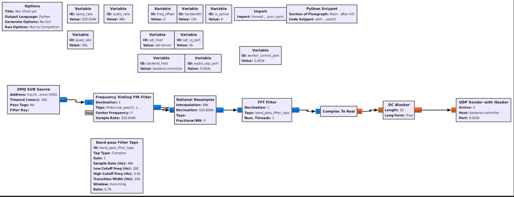

**Note about ZMQ blocks**: The flowgraph uses ZMQ (ZeroMQ) source and sink blocks to support SATCOM's multi-client architecture. If you want to run this flowgraph directly in GNU Radio on your own computer, simply replace the ZMQ SUB Source with a PlutoSDR Source block and replace the UDP Audio Sender with an Audio Sink block. Everything in between stays exactly the same-the signal processing is identical whether you're running standalone or as part of the multi-client system.

Now let's walk through each block and understand what it does.

---

#### Block 1: Input Source (ZMQ SUB / PlutoSDR Source)

The flowgraph starts by receiving I/Q samples. In SATCOM's architecture, this comes from a ZMQ subscription to the SDR server. For standalone use, you'd configure a PlutoSDR Source directly:

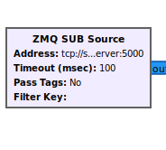 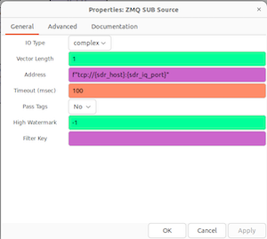

**Configuration parameters:**
- **Sample Rate**: 520834 Hz (approximately 520 kHz)
- **Center Frequency**: 739.7 MHz (the IF from the LNB)
- **Data Type**: Complex float32 (I/Q pairs)

At this point, we have a stream of complex samples representing the entire 250 kHz transponder bandwidth. Every signal within that transponder is present in this data stream-we just need to extract the one we want.

---

#### Block 2: Frequency Xlating FIR Filter

This block does two jobs at once: it shifts our desired frequency to baseband (0 Hz) and performs initial filtering.

**What it does:**

Imagine the transponder is centered at 739.7 MHz, but you want to listen to a station transmitting at 739.750 MHz. That's an offset of +50 kHz from center. The Frequency Xlating FIR Filter multiplies the input signal by a complex exponential that shifts everything by -50 kHz. Your target signal, previously at +50 kHz in the spectrum, is now at 0 Hz (baseband). Everything else shifts too, but we don't care about those signals.

The "FIR" part refers to the Finite Impulse Response filter built into this block. As it shifts frequencies, it also applies a low-pass filter to prevent aliasing and to start selecting our desired bandwidth. The filter taps are designed as a low-pass with cutoff at `bandwidth/2`.

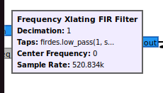 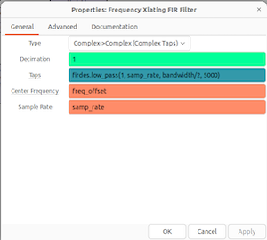

**Configuration parameters:**
- **Center Frequency Offset**: Variable (e.g., 50000 Hz) - this is what changes when you tune
- **Decimation**: 1 (no decimation in this block)
- **Sample Rate**: 520834 Hz
- **Filter Taps**: `firdes.low_pass(1, 520834, bandwidth/2, 5000)`
  - For 2.7 kHz SSB: cutoff at 1350 Hz
  - Transition width: 5000 Hz

**Output**: Complex samples at 520834 Hz, with your signal now centered at 0 Hz.

---

#### Block 3: Rational Resampler

Now we need to reduce the sample rate from 520 kHz down to something more manageable for audio. The Rational Resampler changes the sample rate by a ratio of integers.

**What it does:**

It resamples from 520834 Hz to 48000 Hz, which is a ratio of approximately 48000/520834 ≈ 0.0921. GNU Radio implements this efficiently using polyphase filtering-essentially, it computes only the output samples we need rather than naively upsampling and then downsampling.

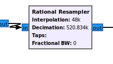 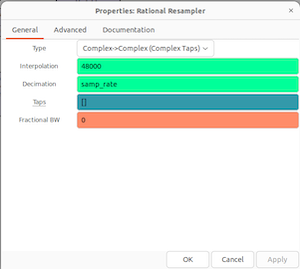

**Configuration parameters:**
- **Interpolation**: 48000
- **Decimation**: 520834
- **Filter Taps**: [] (automatic)

After this block, we're working with samples at 48 kHz-a standard audio rate that's much easier to process and matches what audio systems expect.

**Output**: Complex samples at 48000 Hz, still centered at 0 Hz.

---

#### Block 4: Band-Pass Filter (FFT Filter)

Even though we're at baseband and have decimated, we still need to carefully select just the bandwidth we want-typically 2.7 kHz for SSB voice.

**What it does:**

This is an FFT-based filter (faster than direct FIR for long filters) that passes frequencies from 300 Hz to 3500 Hz. Why 300 Hz as the low cutoff? Because voice doesn't contain much energy below that, and cutting it out removes rumble, hum, and any DC offset that might remain. The 3500 Hz upper limit captures all the voice frequencies without including excessive high-frequency noise.
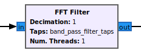 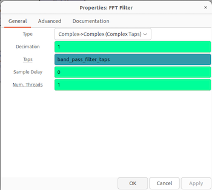

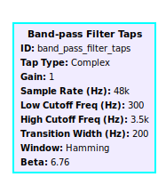      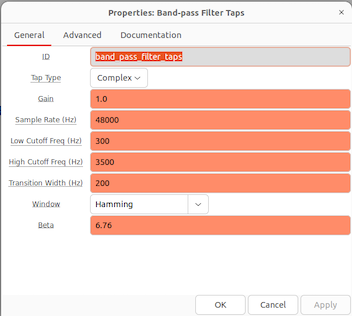

**Configuration parameters:**
- **Type**: Complex-to-Complex (ccc)
- **Filter Taps**: Band-pass filter
  - Low cutoff: 300 Hz
  - High cutoff: 3500 Hz
  - Sample rate: 48000 Hz
  - Window: Hamming

The Hamming window shapes the filter's frequency response to minimize ripples in the passband and stopband.

**Output**: Complex samples at 48000 Hz, containing only the 300-3500 Hz voice band.

---

#### Block 5: Complex to Real (SSB Demodulation)

This is where the actual demodulation happens. SSB signals are essentially audio that's been frequency-shifted up to RF. To recover the audio, we need to shift it back down.

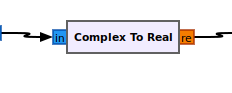 

**What it does:**

For Upper Sideband (USB), we simply take the real part of the complex signal. That's it. The mathematics works out because we've already translated the signal to baseband-the SSB modulation exists from 0 Hz upward (for USB). Taking the real part effectively "mixes down" the modulated signal to recover the original audio.

For Lower Sideband (LSB), you'd conjugate the complex signal first (flip the sign of the imaginary part), then take the real part.

**Why this works:**

When an SSB signal is at baseband, it's essentially `audio(t) * exp(j*2*pi*f*t)` where f is small. The real part extracts the audio envelope. If you're familiar with mixing and heterodyning in RF, this is the same principle-we're mixing with a 0 Hz "carrier" (which means just taking the real part).

**Output**: Real (float) samples at 48000 Hz, containing the demodulated audio.

---

#### Block 6: DC Blocker

Audio shouldn't have a DC component (a constant offset), but sometimes one creeps in from imperfect filtering or hardware biases. The DC Blocker removes it.

**What it does:**

It's essentially a high-pass filter with a very low cutoff (a few Hz), implemented as a simple recursive filter. This removes any constant bias in the audio while passing all the voice frequencies unchanged.

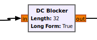 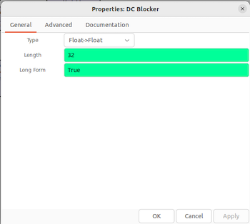

**Configuration parameters:**
- **Length**: 32 (how many samples to average)
- **Long Form**: True (uses better algorithm)

**Output**: Real (float) samples at 48000 Hz, with DC offset removed.

---

#### Block 7: Output Sink (UDP Sender / Audio Sink)

The final stage sends the audio somewhere useful.

 

**For SATCOM's multi-client architecture**: The UDP Audio Sender block packages the float32 PCM samples and sends them via UDP to the backend controller, prefixed with the pod name so the backend knows which client to route them to.

**For standalone GNU Radio use**: Replace this with an Audio Sink block that connects to your computer's sound card. You'll hear the audio directly through your speakers.

**Output**: Float32 PCM audio at 48 kHz, ready to be played or streamed.

---

### 4.3 The Graphics Flowgraph (Waterfall Visualization)

While the audio flowgraph extracts one specific frequency, the graphics flowgraph gives us a view of the entire transponder. This is how we generate the waterfall display that shows all activity across the 250 kHz bandwidth.

#### The Complete Graphics Processing Chain

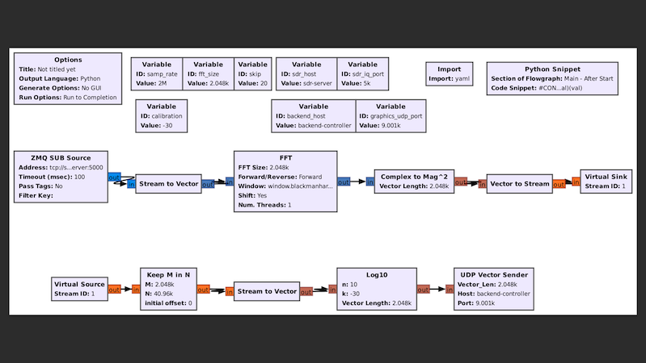

Again, for standalone use, replace ZMQ SUB Source with PlutoSDR Source and UDP Vector Sender with a GUI sink like QT GUI Waterfall or QT GUI Frequency Sink.

---

#### Understanding FFT (Fast Fourier Transform)

Before we walk through the blocks, let's understand what FFT does, since it's the core of visualization.

**What is FFT?**

The Fast Fourier Transform converts time-domain signals into frequency-domain representation. Imagine you have 2048 consecutive I/Q samples representing a brief moment in time. The FFT analyzes these samples and tells you how much energy exists at each frequency within your sample bandwidth.

**Input**: 2048 complex time-domain samples
**Output**: 2048 complex frequency-domain bins

Each bin represents a small slice of frequency. With a sample rate of 2 MHz and 2048 points, each bin is 2000000/2048 ≈ 977 Hz wide. The output is complex (magnitude and phase), but for visualization we only care about magnitude-how strong is the signal at each frequency?

> **Note**: The graphics worker uses a higher sample rate (2 MHz) than the audio workers (520 kHz) to capture a wider view of the transponder for visualization purposes.

**Why it's useful:**

Instead of showing you numbers flying by (which would be meaningless), FFT lets us see which frequencies have signals right now. Do this repeatedly-say 10 times per second-and you get a real-time spectrum analyzer. Stack these spectrums vertically as a scrolling display, and you get a waterfall showing how signals change over time.

---

#### Block 1: Input Source

The graphics worker receives I/Q samples covering a wider bandwidth than the audio workers. While audio workers use 520834 Hz to focus on the narrowband transponder, the graphics worker uses **2 MHz sample rate** to capture the full transponder view for visualization.

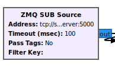 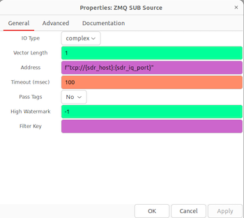

**Configuration parameters:**
- **Sample Rate**: 2000000 Hz (2 MHz)
- **Center Frequency**: 739.7 MHz (the IF from the LNB)
- **Data Type**: Complex float32 (I/Q pairs)

---

#### Block 2: Stream to Vector

FFT operates on vectors (blocks of samples), not streams. This block collects 2048 consecutive samples and packages them as a single vector.

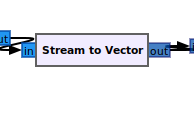 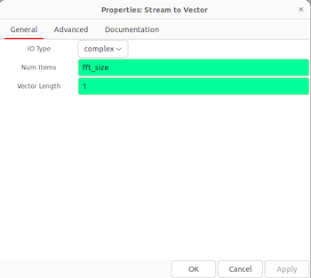

**Configuration:**
- **Vector Size**: 2048 (the FFT size)

Every 2048 samples that arrive get bundled into one vector. At 520 kHz sample rate, 2048 samples represent about 3.9 milliseconds of data.

---

#### Block 3: FFT

This is where the magic happens.

**What it does:**

Performs the Fast Fourier Transform on each 2048-sample vector. The output is another 2048-point vector, but now in the frequency domain instead of time domain.

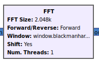 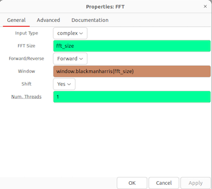

**Configuration parameters:**
- **FFT Size**: 2048
- **Forward**: True (time → frequency, not inverse)
- **Shift**: True (rearranges so 0 Hz is in center, negative frequencies on left)
- **Window**: Blackman-Harris

**Why windowing?** 

Without a window, the FFT assumes your input signal repeats infinitely. Discontinuities at the boundaries cause spectral leakage-signal energy spreads into adjacent bins. A window function (like Blackman-Harris) smoothly tapers the signal to zero at the edges, reducing leakage. The tradeoff is slightly wider main lobes, but cleaner overall spectrum.

**Output**: Complex vector of 2048 frequency bins.

---

#### Block 4: Complex to Mag Squared

For visualization, we don't need phase information-only power.

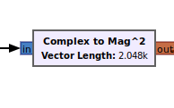

**What it does:**

For each complex number z = a + jb in the FFT output, this computes |z|² = a² + b². This is the power (squared magnitude) of the signal at that frequency bin.

**Output**: Real vector of 2048 power values (float).

---

#### Block 5: Vector to Stream

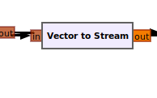

Convert the vector back to a stream so we can decimate (skip some FFTs).

---

#### Block 6: Keep M in N

Computing FFT 130 times per second (520000/2048 ≈ 254 FFTs/sec) generates too much data. We don't need that many waterfall lines.

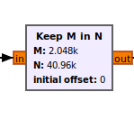 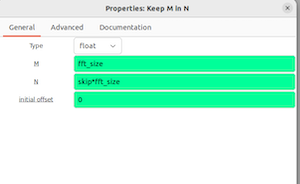

**What it does:**

Keeps M items out of every N items, discarding the rest. In our case:
- **M**: fft_size (2048) - keep one complete FFT
- **N**: skip × fft_size (30 × 2048 = 61440) - out of every 30 FFTs

So we keep 1 FFT and throw away the next 29. This reduces our update rate to about 254/30 ≈ 8-9 FFTs per second, which is perfectly smooth for a waterfall display.

---

#### Block 7: Stream to Vector (again)
 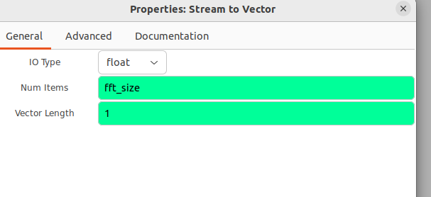

Package the decimated stream back into vectors for the dB conversion.

---

#### Block 8: NLog10

Convert linear power values to logarithmic (dB) scale for better visualization.

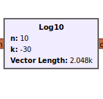 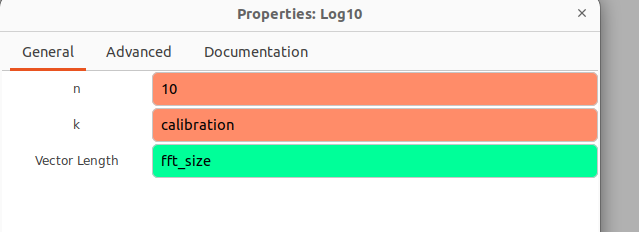

**What it does:**

Computes `10 × log10(power) + calibration` for each bin. The calibration offset (typically -72 dB in config) adjusts the display levels so weak signals are visible and strong signals don't saturate the color scale.

**Output**: Real vector of 2048 dB values.

---

#### Block 9: Output Sink

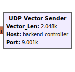 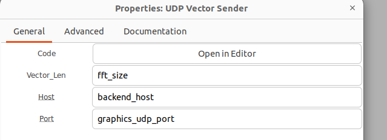

For SATCOM: UDP Vector Sender transmits each FFT vector to the backend controller, which broadcasts to all WebSocket clients for rendering.

For standalone GNU Radio: Use QT GUI Waterfall or QT GUI Frequency Sink to display directly in GNU Radio Companion.

---

### 4.4 Tying It Together

These two flowgraphs-audio and graphics-form the core of SATCOM's signal processing.

**The audio flowgraph** is personalized: each client gets their own instance with their own tuning offset. When you tune to a different frequency, only your audio worker's Frequency Xlating FIR Filter changes-nobody else is affected.

**The graphics flowgraph** is shared: one instance computes FFT for the entire transponder, and everyone sees the same waterfall. This is efficient because FFT is computationally expensive, and there's no point computing it separately for each user when everyone needs the same view.

**For standalone use**: You can run either flowgraph directly in GNU Radio Companion. Just replace:
- ZMQ SUB Source → PlutoSDR Source (configure IP, sample rate, center frequency)
- UDP Sender / UDP Vector Sender → Audio Sink / QT GUI Waterfall

Everything else-the filters, FFT, demodulation-works identically. The multi-client architecture is just plumbing that distributes the processing across containers. The actual signal processing is pure GNU Radio.

---

## 5. SATCOM's Multi-Client Architecture

SATCOM's goal is to let many people simultaneously access the same ground station through a web browser. How do we make that happen?

### 5.1 The Multi-Client Challenge

Running multiple GNU Radio flowgraphs simultaneously on one computer is inefficient. Each instance would need its own PlutoSDR source (but there's only one PlutoSDR!), each would compute its own FFTs (wasteful-everyone sees the same spectrum), and coordinating everything would be a nightmare.

SATCOM solves this by splitting the work intelligently:

**What can be shared**: 
- The PlutoSDR hardware (one device, one I/Q stream)
- The FFT visualization (everyone sees the same waterfall)

**What must be personalized**:
- Audio demodulation (each client tunes to different frequencies)
- Audio output (each client gets their own audio stream)

### 5.2 The Architecture

SATCOM uses four main components:

**SDR Server**: Connects to the PlutoSDR and publishes the I/Q stream via ZMQ (ZeroMQ). This is the "master receiver" that captures the raw data once and makes it available to everyone else.

**Graphics Worker**: Runs the graphics flowgraph we just described. It subscribes to the SDR server's I/Q stream via ZMQ, computes FFTs, and sends the results via UDP to the backend controller. There's only one graphics worker because everyone needs the same waterfall view.

**Audio Workers**: Each connected client gets their own dedicated audio worker container. These run the audio flowgraph we described, subscribing to the same I/Q stream from the SDR server but with different tuning offsets. When you tune to 739.750 MHz and I tune to 739.680 MHz, we have separate audio workers processing our respective frequencies.

**Backend Controller**: The coordinator. It manages client connections via WebSocket, spawns and destroys audio worker containers via Kubernetes, receives UDP streams from all the workers, and routes audio and graphics data to the appropriate clients.

### 5.3 The Worker Containers

Both workers are GNU Radio flowgraphs packaged as Docker containers:

**audio_worker.grc**: The audio flowgraph with ZMQ source (subscribes to SDR server) and UDP sink (sends to backend). Configuration parameters like `freq_offset` and `bandwidth` are set dynamically via control messages.

**graphics_worker.grc**: The graphics flowgraph with ZMQ source (subscribes to SDR server) and UDP sink (sends FFT vectors to backend).

**sdr_server.grc**: The PlutoSDR interface with a ZMQ publisher that broadcasts I/Q samples to all workers.

### 5.4 Configuration File (config.yaml)

Everything is configured through one YAML file located at `config/config.yaml`. All workers, backend, and frontend read from this file to ensure consistent configuration across the entire system.

> **Important**: The GNU Radio flowgraph files (.grc) contain default values that are **overridden at runtime** by config.yaml. Always edit config.yaml to change system behavior, not the .grc files.

**Complete configuration file:**

```yaml
# =============================================================================
# ===                         GLOBAL SDR SETTINGS                           ===
# =============================================================================
samp_rate: 520834
lo_freq: 739700000          # Local Oscillator
lnb_lo_freq: 9750000000

# =============================================================================
# ===                        HARDWARE INTERFACE                             ===
# =============================================================================
iio_uri: "ip:192.168.2.1"
rf_bandwidth: 250000
buffer_size: 32768

# =============================================================================
# ===                         GRAPHICS WORKER                               ===
# =============================================================================
fft_size: 2048
calibration: -72
skip: 30

# =============================================================================
# ===                          AUDIO WORKER                                 ===
# =============================================================================
audio_rate: 48000
quad_rate: 50000
bandwidth: 2700  # Default bandwidth (also used by frontend)
freq_offset: 0
is_active: 0

# =============================================================================
# ===                        FRONTEND VALIDATION                            ===
# =============================================================================
max_bw_limit: 15000
min_bw_limit: 90
channel_count: 1
buffer_threshold: 4
max_queue_size: 50

# =============================================================================
# ===                        VISUALIZATION (UI)                             ===
# =============================================================================
range_db: 40
gain_db: -10
gain_attack: 0.001
gain_release: 0.05
view_limit_min: 10489500000
view_limit_max: 10489900000

# =============================================================================
# ===                       NETWORK ARCHITECTURE                            ===
# =============================================================================
sdr_host: "sdr-server"
sdr_iq_port: 5000
sdr_control_port: 5001

backend_host: "backend-controller"
graphics_udp_port: 9001
audio_udp_port: 9002

worker_control_port: 5001
pool_size: 3
worker_headless_service: "audio-workers-headless.default.svc.cluster.local"

# =============================================================================
# ===                        WEBSOCKET CONFIG                               ===
# =============================================================================
ws_url: "https://websdr.fbi.h-da.de"

# Event Protocol
ws_graphics_event: "graphics_data"
ws_audio_event: "audio_data"
ws_server_full_event: "server_full"
ws_worker_assigned_event: "worker_assigned"
ws_worker_released_event: "worker_released"
ws_correction_event: "correction_applied"
ws_connect_event: "connect"
ws_disconnect_event: "disconnect"
ws_request_worker_event: "request_audio_worker"
ws_dismiss_worker_event: "dismiss_audio_worker"
ws_tune_event: "tune"
```

**Key Configuration Parameters:**

- **iio_uri**: PlutoSDR IP address - **must be updated** for your hardware
- **ws_url**: Production WebSocket URL - update for deployment
- **pool_size**: Number of audio worker replicas (default: 3)
- **samp_rate**: Audio worker sample rate (520834 Hz)
- **bandwidth**: Default SSB bandwidth (2700 Hz)
- **calibration**: Waterfall display calibration offset (-72 dB)
- **skip**: FFT decimation factor (keeps 1 out of every 30 FFTs)

### 5.5 How a Client Session Works

1. **You open the web interface**: Your browser connects via WebSocket to the backend controller.

2. **Graphics stream starts immediately**: You see the waterfall display showing the entire transponder. This comes from the single graphics worker.

3. **You request audio**: Click to tune or press "listen." The backend spawns a new audio worker container just for you via Kubernetes.

4. **Your worker initializes**: It subscribes to the SDR server's I/Q stream and waits for tuning commands.

5. **You tune**: Click on the waterfall at 739.750 MHz. The backend calculates the offset (+50 kHz from center) and sends a control message to your audio worker updating its `freq_offset` parameter.

6. **Audio flows**: Your worker processes the signal at that frequency and sends PCM audio via UDP to the backend, tagged with your worker's unique ID. The backend routes it to your WebSocket, and your browser plays it.

7. **You disconnect**: Your WebSocket closes. The backend detects this and terminates your audio worker container. Resources are freed.

Throughout all of this, other users are doing the same thing completely independently, each with their own audio worker and tuning.

### 5.6 Why This Works

**Efficiency**: The expensive operations (hardware access, FFT) happen once and are shared. Only the relatively cheap audio processing is duplicated per client.

**Scalability**: A typical 4-core server can handle 15-20 simultaneous clients. Need more capacity? Add more servers and distribute the workers across them using Kubernetes.

**Isolation**: If one audio worker crashes, only that client is affected. Others continue uninterrupted.

**Simplicity**: The signal processing is pure GNU Radio-nothing exotic. The multi-client plumbing (ZMQ, UDP, WebSocket) is just routing data. You could run the exact same flowgraphs standalone.

---

## 6. Getting Started

This section guides you through setting up and running SATCOM on your own system.

### 6.1 Prerequisites

**Hardware Requirements:**
- Parabolic dish antenna (60-120 cm diameter)
- LNB with external reference input (e.g., hamparts.shop 10 GHz LNB EXT OSC MK3)
- Bias-T box for LNB power and reference injection
- PlutoSDR (ADALM-PLUTO)
- GPS-DO (GPS Disciplined Oscillator) with 10 MHz output
- Linux host computer (4+ cores, 16+ GB RAM recommended)
- Coaxial cables (RG6 or better)

**Software Requirements:**
- **Docker** (for containerization)
- **Kind** (Kubernetes in Docker - for local cluster)
- **kubectl** (Kubernetes command-line tool)
- **GNU Radio 3.10+** (required locally for compiling .grc files with `grcc`)
- **Git** (for cloning the repository)

**Operating System:**
- Linux (Ubuntu 20.04+ recommended)
- Other distributions work but may require dependency adjustments

---

### 6.2 Installation

#### Step 1: Clone the Repository

```bash
git clone https://github.com/Biblink02/WebSDR-Transceiver.git
cd WebSDR-Transceiver
```

#### Step 2: Install Dependencies

**Install Docker:**
```bash
# Ubuntu/Debian
sudo apt update
sudo apt install docker.io docker-compose
sudo usermod -aG docker $USER
# Log out and back in for group changes to take effect
```

**Install Kind:**
```bash
curl -Lo ./kind https://kind.sigs.k8s.io/dl/latest/kind-linux-amd64
chmod +x ./kind
sudo mv ./kind /usr/local/bin/kind
```

**Install kubectl:**
```bash
curl -LO "https://dl.k8s.io/release/$(curl -L -s https://dl.k8s.io/release/stable.txt)/bin/linux/amd64/kubectl"
chmod +x kubectl
sudo mv kubectl /usr/local/bin/
```

**Install GNU Radio:**
```bash
# Ubuntu/Debian
sudo apt install gnuradio gnuradio-dev

# Verify installation
gnuradio-config-info --version  # Should show 3.10.x or higher
```

---

### 6.3 Hardware Setup

#### Dish Pointing

1. **Calculate pointing angles** for Es'hail-2 (25.9°E) from your location:
   - Use online calculators: [dishpointer.com](https://www.dishpointer.com/)
   - Enter your coordinates and satellite position
   - Note azimuth and elevation angles

2. **Mount and point the dish**:
   - Install dish on stable mount
   - Point to calculated azimuth (compass direction)
   - Set elevation angle
   - Fine-tune while monitoring signal strength

3. **Install LNB**:
   - Mount LNB at dish focal point
   - Rotate for **horizontal linear polarization**
   - Connect to Bias-T box via coaxial cable

#### GPS-DO Setup

1. **Position GPS antenna** with clear sky view
2. **Connect GPS-DO** to power and allow 15-20 minutes warm-up
3. **Verify lock**: Most units have LED indicators showing GPS lock status
4. **Connect 10 MHz output** to Bias-T box reference input

#### PlutoSDR Connection

1. **Connect PlutoSDR** to Bias-T box IF output via coaxial cable
2. **Connect PlutoSDR** to host computer via USB
3. **Configure PlutoSDR network**:
   ```bash
   # PlutoSDR default IP is 192.168.2.1
   # Test connection:
   ping 192.168.2.1
   ```

4. **(Optional) Modify PlutoSDR** for external reference:
   - Follow Analog Devices documentation for TCXO replacement
   - This improves frequency stability significantly

---

### 6.4 Configuration

#### Edit config.yaml

Before running the system, you **must** update `config/config.yaml` with your hardware settings:

```bash
cd config
nano config.yaml  # or use your preferred editor
```

**Critical settings to update:**

```yaml
# Update PlutoSDR IP address
iio_uri: "ip:192.168.2.1"  # Change if you modified PlutoSDR network

# For production deployment, update WebSocket URL
ws_url: "https://websdr.fbi.h-da.de"  # Change to your domain

# Adjust pool size based on your server capacity
pool_size: 3  # Number of simultaneous audio workers
```

**Optional tuning parameters:**
- `calibration`: Adjust waterfall display levels (-72 dB default)
- `bandwidth`: Default SSB bandwidth (2700 Hz)
- `skip`: FFT update rate (30 = ~8-9 updates/sec)

---

### 6.5 Deployment

#### Full Deployment (First Run or Code Changes)

If you are running for the first time or have modified source code (Python, Vue.js, or GRC files):

```bash
./deploy.sh
```

This script will:
1. Compile all GNU Radio flowgraphs (.grc → .py)
2. Build Docker images for all components
3. Create Kind cluster and deploy Kubernetes manifests
4. Start all services

**Expected output:**
```
[1/3] Compiling GRC files locally...
Compiling sdr-server/sdr_server.grc...
Compiling audio-worker/audio_worker.grc...
Compiling graphics-worker/graphics_worker.grc...

[2/3] Building Docker images...
[Building frontend, backend, workers...]

[3/3] Starting / updating cluster...
Deployment complete.
```

#### Fast Configuration Reload (Config Changes Only)

If you **only** modified `config/config.yaml` and want to apply changes without rebuilding:

```bash
./reload.sh
```

This updates the Kubernetes ConfigMap and restarts pods with new configuration.

---

### 6.6 Accessing the Web Interface

Once deployment completes:

1. **Open your browser** and navigate to:
   ```
   http://localhost
   ```

2. **You should see**:
   - Waterfall display showing transponder activity
   - Frequency controls
   - Audio playback controls

3. **To listen**:
   - Click on a signal in the waterfall
   - Click "Listen" or "Request Audio Worker"
   - Audio should start playing after worker initialization (~2-3 seconds)

---

### 6.7 Verifying System Status

#### Check Kubernetes Pods

```bash
kubectl get pods
```

**Expected output:**
```
NAME                                  READY   STATUS    RESTARTS   AGE
audio-worker-0                        1/1     Running   0          2m
audio-worker-1                        1/1     Running   0          2m
audio-worker-2                        1/1     Running   0          2m
backend-controller-xxxxxxxxxx-xxxxx   1/1     Running   0          2m
frontend-xxxxxxxxxx-xxxxx             1/1     Running   0          2m
graphics-worker-xxxxxxxxxx-xxxxx      1/1     Running   0          2m
sdr-server-xxxxxxxxxx-xxxxx           1/1     Running   0          2m
```

All pods should show `Running` status.

#### Check Logs

```bash
# Backend controller logs
kubectl logs -f deployment/backend-controller

# Graphics worker logs
kubectl logs -f deployment/graphics-worker

# SDR server logs
kubectl logs -f deployment/sdr-server

# Specific audio worker logs
kubectl logs -f audio-worker-0
```

---

### 6.8 Troubleshooting

#### No Waterfall Display

**Possible causes:**
- Graphics worker not running
- WebSocket connection failed
- PlutoSDR not accessible

**Solutions:**
```bash
# Check graphics worker status
kubectl logs deployment/graphics-worker

# Verify PlutoSDR connection
ping 192.168.2.1

# Check backend WebSocket
kubectl logs deployment/backend-controller | grep -i websocket
```

#### No Audio

**Possible causes:**
- Audio worker failed to start
- No signal at selected frequency
- UDP routing issue

**Solutions:**
```bash
# Check audio worker assignment
kubectl logs deployment/backend-controller | grep -i "worker assigned"

# Check specific audio worker logs
kubectl logs audio-worker-0

# Verify signal exists (check waterfall for activity)
```

#### PlutoSDR Connection Failed

**Possible causes:**
- Wrong IP address in config.yaml
- USB connection issue
- PlutoSDR not powered

**Solutions:**
```bash
# Verify PlutoSDR is detected
lsusb | grep -i pluto

# Check network connectivity
ping 192.168.2.1

# Update config.yaml with correct iio_uri
nano config/config.yaml
./reload.sh
```

#### Weak or No Satellite Signal

**Possible causes:**
- Dish misalignment
- LNB not powered
- Wrong polarization
- Obstruction in line of sight

**Solutions:**
1. Verify GPS-DO is locked (check LED indicators)
2. Re-check dish pointing angles
3. Rotate LNB for horizontal polarization
4. Use satellite finder tool for initial alignment
5. Check for obstructions (trees, buildings)

#### Pods Not Starting

**Possible causes:**
- Docker images not built
- Insufficient resources
- Kind cluster issue

**Solutions:**
```bash
# Rebuild everything
./deploy.sh

# Check cluster status
kubectl cluster-info
kubectl get nodes

# Delete and recreate cluster
kind delete cluster
./deploy.sh
```

---

### 6.9 Stopping the System

```bash
# Stop all pods but keep cluster
kubectl delete -f kubernetes/

# Delete entire Kind cluster
kind delete cluster
```

---

## 7. Future Enhancements

SATCOM is a learning project, and there are many exciting directions it could grow. Here are some potential improvements and extensions that would make great student projects or further explorations.

### Supporting Additional Digital Modes

Currently, SATCOM focuses on SSB voice reception, which is the most common mode on the QO-100 narrowband transponder. However, the transponder also carries various digital modes like PSK31, FT8, RTTY, and even experimental modes like FreeDV. 

Adding demodulators for these modes would involve creating new GNU Radio flowgraphs with different demodulation chains. This would give users a more complete view of transponder activity beyond just voice contacts.

### Wideband Transponder Support

The Es'hail-2 satellite has a second transponder-the wideband transponder-that carries DVB-S and DVB-S2 digital television signals across an 8 MHz bandwidth. This transponder is used for amateur television (DATV), video streaming, and high-speed data experiments.

Supporting the wideband transponder would be a significant extension. The receive chain would be similar (dish, LNB, downconversion), but instead of 250 kHz, you'd need to capture 8 MHz of spectrum. The PlutoSDR can handle this bandwidth, but the processing would be more demanding.The result would be the ability to receive and display amateur television transmissions-watching live video from other continents via satellite.

### Implementing the Transmit Chain

SATCOM is currently receive-only through the web interface, but the ultimate amateur radio satellite experience includes both listening and transmitting. 

### Web-Based Waterfall Recording and Playback

Adding the ability to record waterfall and audio sessions would create valuable learning resources. Students could capture interesting propagation events, record QSOs (contacts) for later analysis, or build a library of different signal types and modulations.

Implementation would involve adding a recording backend that saves FFT data and audio streams to disk, along with timestamps and tuning information. A playback interface would let users scrub through recorded sessions, tune to different frequencies in the recording, and replay audio.

### Signal Analysis and Identification Tools

Extending SATCOM with automated signal analysis would help students learn to identify different signal types. Machine learning models could classify signals as SSB, CW, PSK31, FT8, or other modes based on their characteristics in the waterfall. Visual overlays could highlight active signals and provide information about their likely modulation.

This educational tool would help beginners understand what they're seeing in the waterfall and provide guidance on how to demodulate different signal types. It could also track transponder activity over time, showing patterns like which frequencies are most active, when certain modes are used, and how propagation varies throughout the day.

### Mobile and Responsive Interface

The current web interface is designed for desktop browsers. Adapting it for mobile devices (phones and tablets) would make SATCOM more accessible. This would involve creating a responsive design that works on smaller screens, optimizing the waterfall display for touch interaction, and reducing bandwidth requirements for mobile data connections.

Mobile support would enable field demonstrations, classroom use where students work from tablets, and casual monitoring from anywhere.

### Multi-Satellite Support

While SATCOM focuses on QO-100, the architecture could be adapted to support other satellites. LEO amateur radio satellites like the ISS, various CubeSats, or other geostationary satellites (if more amateur GEO transponders become available) could be added.

This would require antenna tracking for LEO satellites (automatic rotators following orbital predictions), Doppler shift correction (since LEO satellites are moving relative to the ground), and scheduling (determining when satellites are overhead and accessible). It's a much more complex undertaking but would dramatically expand the educational possibilities.


## 8. Contributors

| Name                                                                 | University / Role    |
|----------------------------------------------------------------------|----------------------|
| Stefan Valentin                                                      | Darmstadt University of Applied Sciences - Team Leader |
| [Mihir Kumar Patel](https://www.linkedin.com/in/m1hr-pat/)          | Darmstadt University of Applied Sciences |
| [Vedant Vedant](https://www.linkedin.com/in/vedant-vedant-842964249) | Darmstadt University of Applied Sciences |
| Alberto                                                              | University of Padua |
| Fatemah                                                              | University of Padua |
| Lorenzo                                                              | University of Padua |
| Jimi Röntynen                                                        | Oulu University, Finland |
| Topias Tanskanen                                                     | Oulu University, Finland |
