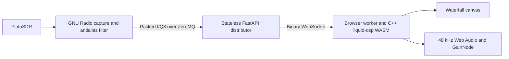

# WebSDR-Transceiver

A browser receiver for QO-100 using PlutoSDR. The server captures and distributes
one packed I/Q stream. Each listener runs C++ WebAssembly DSP locally for the
waterfall and USB/LSB audio, and can tune independently.


```mermaid
flowchart LR
    Pluto[PlutoSDR] --> SDR[GNU Radio capture and antialias filter]
    SDR -->|Packed I/Q8 over ZeroMQ| Backend[Stateless FastAPI distributor]
    Backend -->|Binary WebSocket| Worker[Browser worker and C++ liquid-dsp WASM]
    Worker --> Waterfall[Waterfall canvas]
    Worker --> Audio[48 kHz Web Audio and GainNode]
```

The deployment consists of an SDR source, stateless backend replicas, and a Vue
frontend served by nginx. There is no Redis, Socket.IO, audio-worker pool, server
FFT worker, or compatibility mode. Outbound bandwidth and browser CPU determine
listener capacity: the configured 520,834 complex samples/s costs about 8.33
Mbit/s per listener before overhead.

## Build and deployment

Install Docker, Kind, kubectl and ripgrep. The Docker build pins Emscripten 4.0.15
and Bun 1.4.2 and automatically builds the C++ module and frontend. No host GNU
Radio compiler, Rust toolchain, Node package manager or Git submodule is needed.
liquid-dsp is resolved with CMake FetchContent from a pinned, checksum-verified
release; frontend dependencies use the committed Bun lockfile.

Set hardware and public URL values in `config/config.yaml`, then explicitly deploy:

```bash
bash deploy.sh
```

This updates the Kind cluster, removes obsolete worker/watchdog/Redis workloads,
and rolls out the receiver. It does not delete persistent proxy/certificate data.
The source's health probes restart only its pod after data-flow failure; backend
ZeroMQ subscriptions and browser streams reconnect. `bash reload.sh` reapplies
configuration and restarts receiver deployments without rebuilding images.
`CLUSTER_NAME` selects another Kind cluster; production defaults to `kind`.

The existing nginx Proxy Manager exposes HTTP/HTTPS and its admin UI at
`http://localhost:81`. Point the public receiver host to `frontend-nginx:80` and
enable WebSocket support. `/iq` is proxied through the frontend to the backend.
The `ws_url` config can be an HTTP(S) base URL, a WS(S) base URL, or `/` for the
current origin. The browser derives `/iq` and automatically uses wss for HTTPS.

## Local development

Use Bun 1.4.2, CMake ≥3.20, Emscripten 4.0.15, Python 3.12+ and GNU Radio 3.10+
with IIO support. Build WASM before starting the frontend:

```bash
source /path/to/emsdk/emsdk_env.sh
bash scripts/build-wasm.sh
cd frontend/dev/src
bun install --frozen-lockfile
cp ../../../config/config.yaml public/config.yaml
bun run dev
```

For frontend-only container development, run `bash frontend/dev/run.sh`; the
Compose build includes WASM and mounts application files and central config.
`bash frontend/build-frontend.sh` exports a complete production build to
`frontend/dist` without installing dependencies into host directories.

For a hardware-free receiver, use three terminals. Set the local frontend's
`public/config.yaml` `ws_url` to `http://localhost:8080`; keep the central hardware
configuration unchanged.

```bash
python3 -m venv .venv
.venv/bin/pip install -r backend-controller/requirements.txt -r tests/requirements.txt
PYTHONPATH=shared:sdr-server .venv/bin/python tools/synthetic_iq.py
```

```bash
CONFIG_PATH=config/config.yaml SDR_HOST=127.0.0.1 PORT=8080 \
  PYTHONPATH=shared:backend-controller .venv/bin/python backend-controller/backend_controller.py
```

```bash
cd frontend/dev/src
bun run dev
```

Open `http://localhost:3100/sdr`. The synthetic source contains three tones for
local tuning/sideband verification. Tuning messages never leave the browser.

## Configuration

| Key | Purpose |
| --- | --- |
| samp_rate, lo_freq, lnb_lo_freq | Requested hardware sample rate/LO and displayed LNB frequency offset. Stream metadata uses actual hardware-readback values. |
| iio_uri, rf_bandwidth, buffer_size | Pluto connection, receiver RF bandwidth, and IIO capture buffer. |
| iq_target_rate | Approximate desired distributed rate; GNU Radio applies antialias filtering before integral decimation. |
| iq_frame_samples, iq_scale | Packed frame size (256–65,536 complex samples) and source quantization scale. |
| sdr_host, sdr_iq_port | Backend ZeroMQ upstream. |
| iq_client_queue_size, iq_send_timeout | Bounded per-client queue (1–64 frames) and WebSocket send deadline in seconds. |
| iq_stall_seconds | Backend readiness timeout for upstream data. Backend liveness remains independent of source stalls. |
| sdr_health_port, sdr_stall_seconds | Source health HTTP port and monotonic source/publication stall timeout. |
| ws_url | Public receiver base URL; `/` selects same origin. |
| audio_rate, bandwidth, min_bw_limit, max_bw_limit | Audio output rate (48,000), initial selected audio passband and UI limits (90–15,000 Hz). |
| fft_size, calibration | Power-of-two FFT size (256–8,192) and additive dB calibration. |
| range_db, gain_db, gain_attack, gain_release | Waterfall dynamic range, display gain, and automatic range adaptation. |
| view_limit_min, view_limit_max | Visible RF limits in Hz. |

Backend environment settings override YAML using upper-case names; `PORT` is the
HTTP listening port and `CONFIG_PATH` selects the YAML file. Invalid configuration
fails startup. Source hardware settings are read once at startup. Change central
configuration and restart deployments to apply them.

`GET /stream-info` exposes actual upstream metadata, connected-client count,
malformed/dropped/discontinuous frame counters and last-packet age. `/health`
checks backend subscriber operation; `/ready` requires live I/Q. Source `/health`,
`/ready`, and `/startup` require current capture and publication progress.

To investigate a libiio capture stall, inspect the source's logs and restart count:

```bash
kubectl --context "kind-${CLUSTER_NAME:-kind}" logs deployment/sdr-server --tail=100
kubectl --context "kind-${CLUSTER_NAME:-kind}" get pods -l app=sdr-server
kubectl --context "kind-${CLUSTER_NAME:-kind}" port-forward service/sdr-server 18081:8081
```

In another terminal, `curl http://localhost:18081/health` shows source/publication
ages. Ages over two seconds fail health; backend `/stream-info` shows upstream
age and discontinuities. The probes restart the source and subscribers reconnect.
This isolates recovery; the underlying libiio/RF issue still requires target
hardware logs and a reception test.

## Verification

```bash
cmake -S dsp-wasm -B dsp-wasm/build-native -DCMAKE_BUILD_TYPE=Release
cmake --build dsp-wasm/build-native --parallel 4
ctest --test-dir dsp-wasm/build-native --output-on-failure
bash scripts/build-wasm.sh
bun test tests/wasm.test.ts
cd frontend/dev/src
bun run test
bun run build
bun run typecheck
```

```bash
PYTHONPATH=shared:backend-controller:sdr-server .venv/bin/pytest -q tests
PYTHONPATH=shared:sdr-server /usr/bin/python3 tests/source_flowgraph_check.py
bash -n deploy.sh reload.sh frontend/build-frontend.sh kubernetes/start-cluster.sh scripts/build-wasm.sh
PYTHON_BIN=.venv/bin/python bash tests/check-kubernetes.sh
```

Browser integration uses a locally installed Chromium executable; set
`CHROMIUM_PATH` if it is not `/usr/bin/google-chrome`. It runs the production
frontend against synthetic I/Q, checks waterfall pixels, native audio/volume,
local retuning, source recovery, disconnect cleanup and WASM-load errors. Tests
launch isolated localhost services and leave the existing station unchanged.
The Kubernetes check builds the production containers and uses a temporary Kind
cluster with a separate kubeconfig and synthetic I/Q. It tests nginx delivery and
a source-only liveness restart, then removes the test cluster.

See [TODO.md](TODO.md) for audited status and acceptance evidence and
[the wire protocol and DSP ABI](docs/iq-protocol.md) for implementation details.
Real Pluto reception and libiio stall/recovery must be validated on the target
hardware; synthetic and native tests do not prove RF reception quality.

## Credits and license

Developed through the BIP programme involving the University of Padua, Télécom
Saint-Étienne and Technical University of Darmstadt. Team PRI05: Alberto
(Biblink02), Alexandre (TheAnacondA57), Clément (clfusero), Fatemah (Pitclair),
Lorenzo (Fireentity), Mihir (M1keP1), and Vedant (vedant-224).

Project: [MIT](LICENSE). Browser DSP uses [liquid-dsp](https://github.com/jgaeddert/liquid-dsp),
also MIT; its license is included in the distributed frontend. Hardware capture
uses the system GNU Radio and libiio packages.
