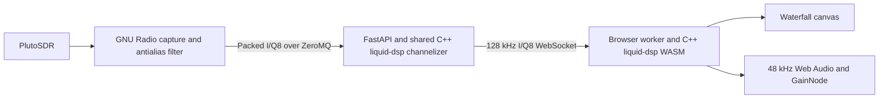

# WebSDR-Transceiver

A browser receiver for QO-100 using PlutoSDR. The server captures and distributes
one packed I/Q stream. Backend replicas produce shared, filtered 128 kHz
subbands. Each listener runs C++ WebAssembly DSP locally for the waterfall
and USB/LSB/CW audio, and can tune independently within its selected band.


```mermaid
flowchart LR
    Pluto[PlutoSDR] --> SDR[GNU Radio capture and antialias filter]
    SDR -->|Packed I/Q8 over ZeroMQ| Backend[FastAPI and shared C++ liquid-dsp channelizer]
    Backend -->|128 kHz I/Q8 WebSocket| Worker[Browser worker and C++ liquid-dsp WASM]
    Worker --> Waterfall[Waterfall canvas]
    Worker --> Audio[48 kHz Web Audio and GainNode]
```

The deployment consists of an SDR source, stateless backend replicas, and a Vue
frontend served directly by Caddy. There is no Redis, Socket.IO, audio-worker pool, server
FFT worker, or compatibility mode. Outbound bandwidth and browser CPU determine
listener capacity. A 128 kHz subband costs 2.05 Mbit/s per listener before
overhead, about 75% less than the 520,834 Hz upstream. Native CPU work is shared
once per active band per replica. See [subband architecture](docs/iq-subbands.md).

## Build and deployment

Install Docker, Kind, kubectl and ripgrep. The Docker build pins Emscripten 4.0.15
and Bun 1.4.2 and automatically builds the C++ module and frontend. No host GNU
Radio compiler, Rust toolchain, Node package manager or Git submodule is needed.
liquid-dsp is resolved with CMake FetchContent from a pinned, checksum-verified
release; frontend dependencies use the committed Bun lockfile.

Set hardware and public URL values in `config/config.yaml`, then explicitly deploy:

```bash
bash deploy.sh
```

This updates the Kind cluster, removes obsolete worker/watchdog/Redis workloads,
and rolls out the receiver, replacing Proxy Manager and the separate nginx frontend.
Existing proxy/certificate volumes are preserved; Caddy uses its own `caddy-data` PVC.
The source's health probes restart only its pod after data-flow failure; backend
ZeroMQ subscriptions and browser streams reconnect. `bash reload.sh` reapplies
configuration and restarts receiver deployments without rebuilding images.
`CLUSTER_NAME` selects another Kind cluster; production defaults to `kind`.

Caddy serves the app and proxies `/iq`, `/bands` and `/stream-info` to the backend. Its versioned
[Caddyfile](config/Caddyfile) contains the station's public hostname. It obtains
and renews HTTPS certificates automatically; DNS must point to the station and
TCP ports 80/443 must reach it. Certificate data persists in `caddy-data`.
There is no admin website or login. `ws_url: /` uses the same origin and secure
WebSockets when the page uses HTTPS. See [Caddy operations](docs/caddy.md).

The SDR console provides signal search, independent automatic frequency/BW and
display gain/range, selectable FFTs through 32,768 points, ten palettes, spectrum
trace, freeze/fullscreen, bookmarks and shared links. FFT/audio stay local to each
browser. Audio AGC/squelch, adjustable CW pitch, pinned tracking/fine AFC, local
audio recordings with tuning metadata and keyboard shortcuts are also available.
Idle capture releases the GNU Radio graph and requests Pluto sleep after
the last viewer leaves. See [console controls](docs/receiver-console.md) and
[capture lifecycle](docs/capture-lifecycle.md).

## Local development

Use Bun 1.4.2, CMake ≥3.20, Emscripten 4.0.15, Python 3.12+ and GNU Radio 3.10+
with IIO support. Build WASM before starting the frontend:

```bash
source /path/to/emsdk/emsdk_env.sh
bash scripts/build-wasm.sh
cd frontend/dev/src
bun install --frozen-lockfile
cp ../../../config/config.yaml public/config.yaml
bun run dev
```

For frontend-only container development, run `bash frontend/dev/run.sh`; the
Compose build includes WASM and mounts application files and central config.
`bash frontend/build-frontend.sh` exports a complete production build to
`frontend/dist` without installing dependencies into host directories.

For a hardware-free receiver, use three terminals. The Vite development server
proxies same-origin `/iq` and `/bands` to `http://127.0.0.1:8080`; `SDR_BACKEND_URL` overrides
the target. Keep the central hardware configuration unchanged.

```bash
cmake -S dsp-wasm -B dsp-wasm/build-native -DCMAKE_BUILD_TYPE=Release
cmake --build dsp-wasm/build-native --target websdr_channelizer --parallel 4
python3 -m venv .venv
.venv/bin/pip install -r backend-controller/requirements.txt -r tests/requirements.txt
PYTHONPATH=shared:sdr-server .venv/bin/python tools/synthetic_iq.py --scenario clean
```

```bash
SUBBAND_LIBRARY="$PWD/dsp-wasm/build-native/libwebsdr_channelizer.so" \
  CONFIG_PATH=config/config.yaml SDR_HOST=127.0.0.1 PORT=8080 \
  PYTHONPATH=shared:backend-controller .venv/bin/python backend-controller/backend_controller.py
```

```bash
cd frontend/dev/src
bun run dev
```

Open `http://localhost:3100/sdr`. The synthetic source contains generated USB/LSB
speech, keyed CW and noise across all five bands. Fine tuning never leaves the browser. Changing the receive band selects a new
`/iq?band=id` stream and stops current audio/recording.
This exercises the production WebAssembly, waterfall and audio code without a
Pluto. The synthetic source is a development/test tool and is not deployed in
the production receiver image. Hardware capture and RF reception remain separate
acceptance checks on the production station when the device is available.

## Local Kubernetes preview and IIO emulation

With Docker, Kind, kubectl and Python's `venv` module:

```bash
bash scripts/demo-cluster.sh
```

The script creates/reuses the ignored `.venv`, installs pinned PyYAML there and
builds the current worktree. It creates the dedicated `websdr-iq-demo` cluster,
with its own kubeconfig, two backend replicas and local HTTP Caddy at
`http://localhost:18080/sdr`. Generated speech/CW and automatic fading, drift,
loss, QRM and source-stall scenarios run without Pluto.

Use `DEMO_SCENARIO=clean` for a stable scene. `DEMO_SOURCE=iio` adds the official
libiio emulator and reads its SSB/CW replay through the production GNU Radio IIO
flowgraph. Ctrl+C stops forwarding; `bash scripts/demo-cluster.sh serve` reopens
the preview and `bash scripts/demo-cluster.sh stop` removes the demo. Stop before
changing its source/scenario. `DEMO_PORT` changes the port and `PYTHON_BIN` selects
the interpreter used to create `.venv`; manual activation is unnecessary.

`bash scripts/check-iio.sh` verifies IIO/GNU Radio independently through Docker.
`bash scripts/check-scenarios.sh` checks recovered speech and keyed CW in the
compiled WASM. See [simulation and emulation](docs/simulation.md) for listening
frequencies, scenario timing, commands, verification and hardware limits.

## Configuration

| Key | Purpose |
| --- | --- |
| samp_rate, lo_freq, lnb_lo_freq | Requested hardware sample rate/LO and displayed LNB frequency offset. Stream metadata uses actual hardware-readback values. |
| iio_uri, rf_bandwidth, buffer_size | Pluto connection, receiver RF bandwidth, and IIO capture buffer. |
| iq_target_rate | Approximate desired distributed rate; GNU Radio applies antialias filtering before integral decimation. |
| iq_subband_rate | Desired native shared subband rate (default 128,000 Hz); catalog spans overlap and exclude the filter transition. |
| iq_frame_samples, iq_scale | Packed frame size (256–65,536 complex samples) and source quantization scale. |
| sdr_host, sdr_iq_port | Backend ZeroMQ upstream. |
| iq_client_queue_size, iq_send_timeout | Bounded per-client queue (1–64 frames) and WebSocket send deadline in seconds. |
| iq_stall_seconds | Backend readiness timeout for upstream data. Backend liveness remains independent of source stalls. |
| sdr_health_port, sdr_stall_seconds | Source health HTTP port and monotonic source/publication stall timeout. |
| sdr_idle_seconds | Grace after the last subscribed backend disconnects, then stop/release capture and request Pluto sleep (default 10 s, range 0–300). |
| ws_url | Public receiver base URL; `/` selects same origin. |
| audio_rate, bandwidth, min_bw_limit, max_bw_limit | Audio output rate (48,000), initial selected audio passband and UI limits (90–15,000 Hz). |
| fft_size, calibration | Initial power-of-two FFT size (256–32,768) and additive dB calibration. Clients can select resolution independently. |
| range_db, gain_db | Initial waterfall dynamic range and display gain; automatic local controls adapt them to the received spectrum. |
| view_limit_min, view_limit_max | Visible RF limits in Hz. |

Backend environment settings override YAML using upper-case names; `PORT` is the
HTTP listening port and `CONFIG_PATH` selects the YAML file. Invalid configuration
fails startup. Source hardware settings are read once at startup. Change central
configuration and restart deployments to apply them.

`GET /bands` returns the bounded catalog without activating capture.
`GET /stream-info` exposes actual upstream metadata, connected-client count, active
subband count, channelization time and delivered bytes,
malformed/dropped/discontinuous frame counters and last-packet age. `/health`
checks backend subscriber operation; `/ready` accepts healthy idle replicas and
requires live I/Q while viewers are present. Source `/health`, `/ready`, and
`/startup` accept idle and bounded warm-up, then require actual capture/publication
progress during streaming. Source health reports demand, capture and power state.

To investigate a libiio capture stall, inspect the source's logs and restart count:

```bash
kubectl --context "kind-${CLUSTER_NAME:-kind}" logs deployment/sdr-server --tail=100
kubectl --context "kind-${CLUSTER_NAME:-kind}" get pods -l app=sdr-server
kubectl --context "kind-${CLUSTER_NAME:-kind}" port-forward service/sdr-server 18081:8081
```

In another terminal, `curl http://localhost:18081/health` shows capture mode and
source/publication ages. During streaming, ages over two seconds fail health;
idle capture is healthy and wake-up has a bounded grace. Backend `/stream-info`
shows upstream age and discontinuities. The probes restart the source and subscribers reconnect.
This isolates recovery; the underlying libiio/RF issue still requires target
hardware logs and a reception test.

## Verification

```bash
cmake -S dsp-wasm -B dsp-wasm/build-native -DCMAKE_BUILD_TYPE=Release
cmake --build dsp-wasm/build-native --parallel 4
ctest --test-dir dsp-wasm/build-native --output-on-failure
bash scripts/build-wasm.sh
bun test tests/wasm.test.ts
cd frontend/dev/src
bun run test
bun run build
bun run typecheck
```

```bash
PYTHONPATH=shared:backend-controller:sdr-server .venv/bin/pytest -q tests
PYTHONPATH=shared:sdr-server /usr/bin/python3 tests/source_flowgraph_check.py
bash -n deploy.sh reload.sh frontend/build-frontend.sh kubernetes/start-cluster.sh scripts/build-wasm.sh scripts/reload-caddy.sh
PYTHON_BIN=.venv/bin/python bash tests/check-kubernetes.sh
```

Browser integration uses a locally installed Chromium executable; set
`CHROMIUM_PATH` if it is not `/usr/bin/google-chrome`. It runs the production
frontend against synthetic I/Q, checks waterfall pixels, native audio/volume,
local retuning, source recovery, disconnect cleanup and WASM-load errors. Tests
launch isolated localhost services and leave the existing station unchanged.
The Kubernetes check builds the production containers and uses a temporary Kind
cluster with a separate kubeconfig and synthetic I/Q. It tests Caddy HTTPS/WSS
using a trusted local CA, idle/wake and a source-only liveness restart, then removes
the test cluster. It makes no public ACME requests and does not deploy production.

See [TODO.md](TODO.md) for audited status and acceptance evidence and
[the wire protocol and DSP ABI](docs/iq-protocol.md) for implementation details.
Real Pluto reception and libiio stall/recovery must be validated on the target
hardware; synthetic and native tests do not prove RF reception quality.

## Credits and license

Developed through the BIP programme involving the University of Padua, Télécom
Saint-Étienne and Technical University of Darmstadt. Team PRI05: Alberto
(Biblink02), Alexandre (TheAnacondA57), Clément (clfusero), Fatemah (Pitclair),
Lorenzo (Fireentity), Mihir (M1keP1), and Vedant (vedant-224).

Project: [MIT](LICENSE). Browser DSP uses [liquid-dsp](https://github.com/jgaeddert/liquid-dsp),
also MIT; its license is included in the distributed frontend. Hardware capture
uses the system GNU Radio and libiio packages.
