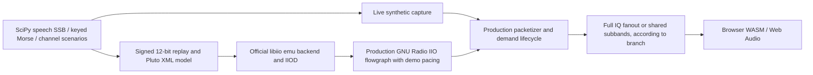

# Hardware-free receiver testing

Two local capture paths exercise the same packed I/Q publisher, bounded fanout
and browser C++ WASM receiver. `feat/webassembly` forwards the complete I/Q stream;
`feat/iq-subbands` applies a shared native channelizer before distribution:



## Start the persistent demo

From either branch's worktree, with Docker, Kind, kubectl and Python's
`venv` module installed:

```bash
bash scripts/demo-cluster.sh
```

The script creates/reuses the ignored `.venv`, installs pinned PyYAML there,
builds the current code, creates `websdr-iq-demo` with its own kubeconfig, and
forwards Caddy to `http://localhost:18080/sdr`. Two backend replicas serve the
complete I/Q stream on `feat/webassembly` or five overlapping receive bands on
`feat/iq-subbands`. The default source is live synthetic capture running
the `automatic` scenario. Capture starts when a viewer connects.

Choose a stable scene or the IIO path before creating the cluster:

```bash
DEMO_SCENARIO=clean bash scripts/demo-cluster.sh
DEMO_SOURCE=iio bash scripts/demo-cluster.sh
DEMO_SOURCE=iio DEMO_SCENARIO=fading bash scripts/demo-cluster.sh
```

Use one command at a time; `start` refuses to reuse an existing cluster. Ctrl+C
stops forwarding and leaves the demo available. Reopen or remove it with:

```bash
bash scripts/demo-cluster.sh serve
bash scripts/demo-cluster.sh stop
```

Stop the demo before changing branch, source or scenario and rebuilding. `DEMO_PORT`
changes the local port. `PYTHON_BIN` selects the interpreter that creates the
virtual environment; activation is unnecessary. `manifest` prints generated
YAML without creating a cluster. The script uses its own kubeconfig and test
image tags, and does not modify the central hardware configuration.

## Stations and listening

These frequencies use the repository's 739.7 MHz IF and 9.75 GHz LNB offset.
Set the displayed RF frequency and mode, then start audio. On `feat/iq-subbands`,
first select the band from the table; `feat/webassembly` exposes all frequencies
in one stream.
Use approximately 3 kHz bandwidth for speech and 500 Hz for CW.

| Band | RF frequency (Hz) | Mode | Signal |
| --- | ---: | --- | --- |
| -2 | 10489540000 | CW | `CQ TEST`, 15 WPM |
| -1 | 10489620000 | USB | Generated speech |
| 0 | 10489688000 | USB | Generated speech, fading/QRM target |
| 0 | 10489701000 | CW | `CQ CQ DE WEBSDR TEST`, 18 WPM, drift target |
| 0 | 10489731000 | LSB | Generated speech |
| 1 | 10489780000 | LSB | Generated speech |
| 2 | 10489860000 | CW | `WEBSDR`, 22 WPM |

The bundled mono PCM16 voice was generated from the project's
`tools/simulation/speech.txt` using eSpeak NG. It is filtered to 300–2700 Hz with
SciPy. `signal.hilbert` creates analytic speech and `signal.resample` performs
rate conversion; conjugation chooses LSB. Morse uses standard timing and SciPy
Tukey windows for 5 ms key edges. No receiver DSP implementation is duplicated.
Rebuild the voice fixture, when intentionally changing the phrase, with:

```bash
docker build -f tools/simulation/Dockerfile.voice \
  --output type=local,dest=tools/simulation/audio .
```

## Automatic scenarios

The versioned JSON catalog uses a fixed random seed, station IDs and events in
sample time. Blocks preserve modulation phase and deterministic noise regardless
of chunk size. A live transport stall follows wall time; its return skips missing
sample time without emitting a rapid backlog. Idle/wake starts a fresh scene.

Available scenes are `clean`, `fading`, `drift`, `squelch`, `qrm`, `recovery` and
`automatic`. The separate `tones` calibration fixture retains exact carriers for
frequency, rejection and automation regression tests.

The automatic cycle lasts 48 seconds:

| Capture time | Action |
| --- | --- |
| 0–4 s | Speech and CW with a -48 dBFS noise floor |
| 4–12 s | Deep 0.7 Hz fading on central USB |
| 12–24 s | CW frequency drift ramps up to +72 Hz and returns to zero |
| 24–28 s | Stations disappear; noise remains for squelch/loss tests |
| 28–34 s | Strong in-passband QRM on central USB |
| 30–33 s | Noise rises to -24 dBFS |
| 34–42 s | Publication stalls; Kubernetes source liveness can restart capture |
| 42–48 s | Recovery, if running outside Kubernetes |

On Kubernetes, a liveness restart starts a new epoch and scene. Backend/frontend
workloads remain running. A custom catalog can be supplied to the live source
with `--scenario-config`; frequencies, amplitudes, duration, event parameters,
station count and buffers are validated/bounded.

For a local process instead of Kubernetes:

```bash
python3 -m venv .venv
.venv/bin/python -m pip install -r tests/requirements.txt -r backend-controller/requirements.txt
PYTHONPATH=shared:sdr-server .venv/bin/python tools/synthetic_iq.py --scenario clean
```

## IIO integration

The emulator container builds the official Analog Devices
[libiio emulation backend](https://github.com/analogdevicesinc/libiio/blob/main/README_BUILD.md)
at commit `1f2ade12b3a97527334a8ed9319d4c2b63b9d4b7`, with a verified archive
SHA-256. It uses upstream IIOD with `-u emu:/data/pluto.xml`. The distribution's
GNU Radio client uses the text IIO protocol; standalone `iiod-emu` uses the new
binary protocol. Serving the same official `emu:` backend through IIOD lets the
production client and its GNU Radio block remain unchanged.

An init container generates the minimal AD9361 PHY/ADC profile and interleaved
little-endian signed 12-bit values in 16-bit words. The official backend loops
`cf-ad9361-lpc_buf0.bin`. The source connects to `ip:iio-emulator`; no physical
SDR is needed. The emulator runs without root. GNU Radio's existing throttle
block supplies the clock missing from file replay, between the actual IIO source
and the existing antialias/publisher path. Production hardware capture has no
throttle. Both paths use the existing demand-driven capture and ENSM controls.

IIO replay supports `clean`, `fading`, `drift`, `squelch` and `qrm`. Transport-stall
scenes are rejected for file replay rather than silently ignored. IIO network
recovery is checked by replacing the emulator pod during active reception.

Run the isolated Docker check without installing GNU Radio on the host:

```bash
bash scripts/check-iio.sh
```

It generates a two-second replay, starts an unprivileged emulator with no host
port, runs five complete capture/sleep/wake cycles through `CaptureController`
and the production `ReceiverSource`, checks sample rate,
center, RF bandwidth, AGC/tracking/FIR attribute writes and ENSM sleep/wake, and
compares 64 packed payloads per cycle byte for byte with the replay. Reopening must produce
the same samples and a fresh epoch. Temporary containers/data are removed.

## Signal and receiver checks

After building WASM and installing the local `.venv` requirements:

```bash
.venv/bin/python -m pytest -q tests
bash scripts/check-scenarios.sh
```

The latter prepares independent USB/LSB/CW vectors, runs the compiled liquid-dsp
WASM through Bun, and compares decoded speech against the original WAV while
allowing causal filter delay. It also checks CW pitch/key-up silence. Unit tests
cover sideband suppression, chunk invariance, noise levels, drift/fading/loss,
Morse timing/edges and scheduled capture stall/resumption.

For a running demo, the additional integration check uses its dedicated context:

```bash
KUBECONFIG=/tmp/websdr-iq-demo/kubeconfig PYTHONPATH=.:shared:backend-controller \
  .venv/bin/python tests/demo_cluster_check.py --mode synthetic --stream subbands
```

Use `--stream full` for the `feat/webassembly` demo and `--mode iio` for the IIO
source. That check replaces only its emulator pod and waits for GNU Radio/source
recovery, then checks idle/wake. It reads five listeners through Caddy; the
subband version requires visible signals in all five bands.

Initially verified on 2026-10-04 on `feat/iq-subbands`: 31 Python tests, native CTest, nine Bun tests and seven
compiled-WASM tests passed, along with Vue typechecking and the production build.
Recovered USB/LSB speech correlation was 0.9931/0.9967. Both Kubernetes source
paths passed five-listener recovery with zero backend/frontend restarts. A real
Chromium session played USB speech and created a local recording through the
complete IIO/GNU Radio/Caddy/subband/WASM path without runtime errors.

The subsequent lifecycle review passed all 32 Python tests on `feat/webassembly`
and 30 targeted capture/distribution/native tests on `feat/iq-subbands`, including
idle-notification and shutdown-cancellation interleavings. Five controller-driven
GNU Radio/IIO capture/sleep/wake cycles produced correct samples and fresh epochs.
The full-stream frontend passed Vue typechecking, nine Bun tests, the production
build and the generated-signal WASM check. Both demo manifest variants match
between branches except for subband configuration and the `/bands` proxy route.

The model proves software IIO configuration/streaming and receiver behavior. It
does not model actual RF sensitivity, hardware-rounded sample rates, physical
AGC/tracking/FIR effects, ENSM power consumption, USB transport or the station's
original hardware fault. Those remain physical Pluto acceptance checks.
